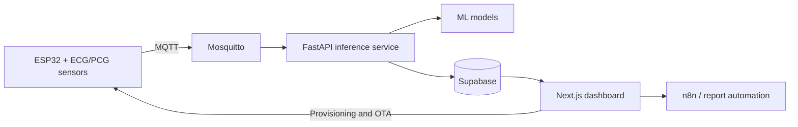

# AscultiCor

**An end-to-end, AI-assisted cardiac monitoring platform for ECG and PCG signals.**

AscultiCor connects an ESP32-based acquisition device to a secure cardiac-monitoring dashboard. It captures electrocardiogram (ECG) and phonocardiogram (PCG) signals, streams them over MQTT, applies machine-learning models, and presents live waveforms, predictions, device telemetry, and generated reports.

> [!IMPORTANT]
> AscultiCor is an academic prototype. It is not a certified medical device and must not be used to diagnose, treat, or make clinical decisions.

## Highlights

- Live ECG and PCG waveform monitoring
- AI-assisted heart-sound, murmur, and arrhythmia analysis
- ESP32 provisioning and device-scoped MQTT credentials
- Patient, session, device, report, and audit workflows
- Organization-level authorization with Supabase Auth and Row Level Security
- Firmware release and over-the-air update support
- Optional n8n automation and LLM-generated report workflows
- Local and cloud deployment with Docker Compose

## Architecture



1. The device samples ECG and PCG signals and publishes measurements through MQTT.
2. Mosquitto authenticates the device and routes telemetry to the inference service.
3. FastAPI preprocesses signal windows, executes the model pipeline, and stores results.
4. Supabase provides PostgreSQL, authentication, storage, and access-control policies.
5. The Next.js application displays live sessions, analytics, reports, and device state.

## Technology Stack

| Layer | Technologies |
| --- | --- |
| Hardware | ESP32-WROOM-32, AD8232 ECG sensor, MAX9814 PCG microphone |
| Web | Next.js 14, React 18, TypeScript, Tailwind CSS |
| Inference | Python, FastAPI, TensorFlow/Keras, XGBoost |
| Data and identity | Supabase PostgreSQL, Auth, Storage, Row Level Security |
| Messaging | Eclipse Mosquitto, MQTT |
| Operations | Docker Compose, Nginx, n8n, Terraform |

## Repository Layout

```text
frontend/             Web dashboard and API routes
inference/            FastAPI service, preprocessing, and model runtime
firmware/             ESP32 firmware and release metadata
models/               Runtime model artifacts and validation outputs
mosquitto/            MQTT broker configuration and credential tooling
supabase/             Schema migrations, seed data, and Edge Functions
simulator/            Synthetic device and signal simulator
n8n/                  Optional automation workflows
nginx/                Reverse-proxy configuration
docs/                 Architecture, hardware, deployment, and operations guides
scripts/              Build, deployment, validation, and documentation utilities
training/              Reproducible model-training scripts
```

## Quick Start with Docker

### Prerequisites

- Docker Engine with Docker Compose v2
- A Supabase project
- Git

For frontend-only development, install Node.js 20 or newer. Python 3.11 is recommended for the inference service and simulator.

### 1. Configure the application

```bash
git clone <repository-url> asculticor
cd asculticor
cp .env.example .env
```

Fill in the required Supabase and application values in `.env`. Never commit this file. For a cloud deployment, begin with `.env.cloud.example` and follow the deployment section in the [application guide](docs/README.md).

### 2. Prepare the database

- New environment: apply `supabase/migrations/apply_this_in_supabase.sql` in the Supabase SQL editor.
- Existing environment: apply the numbered files in `supabase/migrations/` in ascending order.

The numbered migrations are the source of truth for upgrades. `supabase/seed.sql` provides demonstration metadata but does not create Supabase Auth users.

### 3. Start the platform

```bash
docker compose up --build -d
docker compose ps
```

| Service | Default address |
| --- | --- |
| Dashboard | `http://localhost:3000` |
| Inference API | `http://localhost:8000` |
| MQTT broker | `mqtt://localhost:1883` |

Use an existing Supabase Auth account or create one from the login page. To stop the stack, run `docker compose down`.

## Local Development

```bash
# Frontend
cd frontend
npm ci
npm run dev

# Inference service (in a separate terminal)
cd inference
python -m venv .venv
# Windows: .venv\Scripts\activate
# Linux/macOS: source .venv/bin/activate
python -m pip install -r requirements.txt
uvicorn app.main:app --reload --port 8000
```

The simulator has its own setup instructions in [simulator/README.md](simulator/README.md).

## Quality Checks

```bash
cd frontend
npm run lint
npm run typecheck
npm run build

cd ../inference
python -m pytest
python -m compileall app
```

On Windows, run the project security checks with:

```powershell
powershell -NoProfile -ExecutionPolicy Bypass -File ./scripts/security-smoke.ps1
```

## Documentation

The consolidated [application guide](docs/README.md) covers architecture, configuration, hardware, firmware, protocols, models, data, deployment, automation, security, testing, and troubleshooting. Component-specific operational notes remain beside their source code.

## Contributing and Security

See [CONTRIBUTING.md](CONTRIBUTING.md) for the development workflow. Report security concerns using the private process in [SECURITY.md](SECURITY.md); do not publish credentials, patient information, or vulnerability details in a public issue.

## License

This project is distributed under the terms in [LICENSE](LICENSE).
