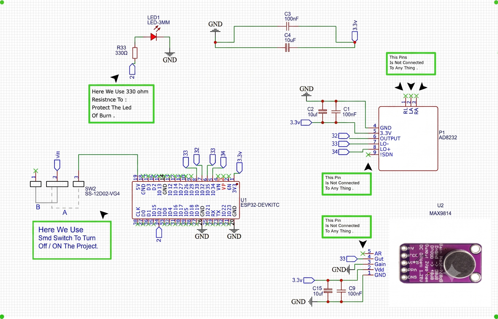
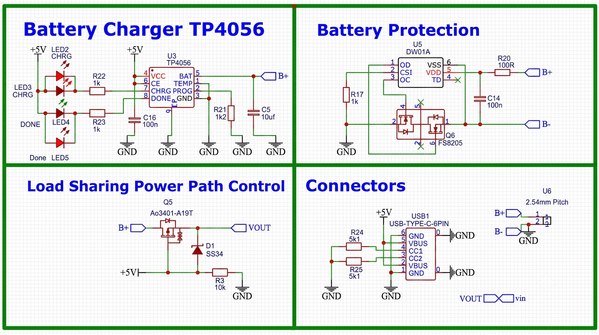

# Chapter 3: System Design and Implementation

## 3.1 Overall System Architecture

AscultiCor is implemented as a layered, event-driven platform that connects a physical cardiac-signal device to an authenticated web application and background automation. The system is deliberately decomposed so that the five project workstreams can develop independently while sharing explicit contracts. The IoT and Hardware workstream owns sensing, embedded control, and MQTT publication. The Artificial Intelligence workstream owns preprocessing, model artifacts, inference, and prediction structure. The Frontend and Backend workstream owns user identity, clinical records, APIs, and visualization. The n8n workstream owns scheduled and event-oriented operational workflows. The Cloud and DevOps workstream owns packaging, network exposure, configuration, security controls, and operational continuity.

The implemented data path begins when an authenticated user creates a patient session and selects a registered device. A server-side Next.js route verifies the user's organization, creates or validates the session, and publishes a start command to the device-specific MQTT control topic. The ESP32 checks its local state and performs signal-quality preflight tests. If the test passes, it publishes session metadata and streams binary PCG and ECG chunks. The FastAPI inference service subscribes to the same organization/device/session hierarchy, reconstructs modality buffers, stores low-rate live metrics, uploads completed recordings, performs configured inference, and persists structured predictions. The dashboard reads the authorized records and presents waveforms, model results, reports, and alerts. n8n invokes internal API actions for asynchronous reporting and operations, while Docker, Mosquitto, NGINX, and environment profiles provide the deployment substrate.

> **Figure 3.1 placeholder — Complete AscultiCor system architecture.** Show sensing, firmware, MQTT, FastAPI inference, model registry, Supabase, Next.js, n8n, NGINX, Docker networks, users, and external notification services. Distinguish public, device-facing, and internal-only interfaces.

### 3.1.1 Stakeholders and User Roles

The primary stakeholders are project operators, supervisors, technical administrators, and clinical reviewers participating in educational demonstrations. A patient is represented as a protected application record rather than as an authenticated system user. The current profile constraint uses two application roles: `admin` and `visitor`. Administrators are intended to manage devices, settings, alerts, audit views, and organization-level resources. Visitors are intended to review permitted patients, sessions, waveforms, predictions, and reports without the full administrative surface.

Authorization is implemented at more than one layer. Next.js middleware protects application routes from unauthenticated access. Pages and API routes apply role- and organization-aware checks. Supabase Row-Level Security (RLS) restricts database rows according to the organization linked to the authenticated profile. Trusted backend processes use service-role credentials only on the server. The device is not a Supabase browser user; it authenticates through a bootstrap secret and receives MQTT-specific credentials. n8n is also not a human user; it calls internal endpoints with an internal token.

The migration history shows an evolution from `operator/admin`, through a broader experimental role set, to the current `visitor/admin` constraint. Some earlier policies still refer to the obsolete `readonly` value. Because a missing role name in a negative check does not automatically make `visitor` read-only, the book does not claim that every visitor restriction is enforced exclusively by RLS. The intended permission model combines UI, API, and database controls, and Chapter 4 includes role tests and migration-drift checks as evidence. This is an example of why a professional system must document both intended design and implemented state.

**Table 3.1 — Stakeholders, identities, and trust boundaries**

| Actor | Identity mechanism | Main capabilities | Primary trust boundary |
| --- | --- | --- | --- |
| Administrator | Supabase Auth user with organization profile | Manage devices and organization features; review sessions, alerts, reports, and audit events | Browser session, server authorization, and RLS |
| Visitor/reviewer | Supabase Auth user with visitor profile | Review authorized project information and selected workflows | Browser session, page/API checks, and RLS |
| Patient record | Organization-scoped database entity | Associated with sessions and reports; not an authenticated actor | Tenant isolation and minimum necessary display |
| ESP32 device | Device ID, bootstrap secret, and per-device MQTT credentials | Publish status and signals; receive scoped control commands | Bootstrap API and broker ACL |
| Inference service | Server-side service role and broker credentials | Consume signals, store recordings, write metrics and predictions | Internal Docker network and protected configuration |
| n8n | Internal API token and n8n credential store | Trigger report, alert, digest, health, enrichment, and escalation workflows | Internal endpoint authorization |
| Cloud operator | SSH and environment access | Deploy, configure, monitor, back up, and recover services | Host operating system and secret management |

### 3.1.2 Functional Requirements

Functional requirements describe observable behavior. The device must be registered and provisioned before it can publish trusted data. An authenticated user must be able to create a patient, select an available device, start a session, observe state changes, review live or replayed waveforms, and inspect structured output after processing. The system must retain enough metadata to connect every recording and prediction to the correct organization and session. It must also support operational workflows without giving the automation engine unrestricted direct access to raw biomedical streams.

The following requirements were derived from the implemented routes, firmware commands, database schema, MQTT contract, and workflow files.

**Table 3.2 — Core functional requirements**

| ID | Requirement | Implementing components |
| --- | --- | --- |
| FR-01 | Authenticate users and associate them with one organization and role | Supabase Auth, profiles table, middleware |
| FR-02 | Register, configure, search, and inspect devices | Device pages and APIs, devices and telemetry tables |
| FR-03 | Provision an ESP32 with Wi-Fi, bootstrap, and broker configuration | Device wizard, Web Serial/serial protocol, bootstrap API, NVS |
| FR-04 | Create and manage patient records | Patients page, patients table, MRN generation |
| FR-05 | Create a recording session and send a device start command | Session page/API, sessions table, MQTT control topic |
| FR-06 | Reject a session when leads or signal preflight fail | Firmware preflight, metadata events, UI/session state |
| FR-07 | Capture and transmit PCG and ECG with explicit sampling metadata | ESP32 timers and buffers, MQTT binary topics |
| FR-08 | Reconstruct recordings and provide live metrics | FastAPI MQTT handler, session buffers, live_metrics |
| FR-09 | Run each enabled model independently and persist structured predictions | Model registry, inference engine, predictions table |
| FR-10 | Store recordings privately and return authorized access | Supabase Storage, recordings table, signed URL functions |
| FR-11 | Display patients, sessions, waveforms, predictions, reports, and alerts | Next.js routes and reusable components |
| FR-12 | Queue and process readable educational reports | llm_reports, `/api/llm`, n8n workflow 01 |
| FR-13 | Detect recent model/session conditions and device-health conditions | Internal workflow API, n8n workflows 02 and 03 |
| FR-14 | Produce daily summaries, recording enrichment, operations checks, and escalation | n8n workflows 04–07 |
| FR-15 | Expose minimal public health and protected operational details | Frontend and inference health/config/metrics endpoints |
| FR-16 | Record security- and workflow-relevant actions | audit_logs and service-side audit writes |

### 3.1.3 Non-Functional Requirements

Non-functional requirements determine whether the system remains understandable and dependable outside the ideal demonstration. Reliability requires bounded memory use, explicit timeouts, reconnect behavior, and idempotent workflow actions. Security requires organization isolation, server-only secrets, scoped device credentials, limited public ports, and protected internal APIs. Maintainability requires versioned migrations, model registry entries, environment-variable documentation, and generated workflow exports. Usability requires clear session states, status feedback, loading and empty states, and visible medical disclaimers.

Performance objectives are constrained by the hardware and virtual-machine budget. PCG acquisition produces roughly 44,444 bytes per second at an actual timer rate near 22,222 samples per second with signed 16-bit samples, before protocol overhead. ECG produces roughly 1,000 bytes per second at 500 samples per second. The high-rate PCG path must therefore use buffers and binary payloads rather than JSON arrays. The browser does not receive every raw device message; lower-rate live metrics and persisted previews are used to keep the interface responsive.

**Table 3.3 — Non-functional requirements and design responses**

| Attribute | Requirement | Design response |
| --- | --- | --- |
| Reliability | A temporary service or network fault must not corrupt unrelated sessions | Per-session buffers, reconnect logic, timeouts, independent model loading, retry states |
| Security | User, device, service, and automation identities must be separated | Supabase sessions, bootstrap secrets, MQTT credentials, service role, internal tokens |
| Privacy | Organization records and private recordings must not be globally readable | `org_id` relationships, RLS, private storage, signed access |
| Performance | Dual-signal acquisition must not block embedded control or UI rendering | Timer flags, multi-buffer PCG queue, binary MQTT, low-rate metrics |
| Maintainability | Configuration and artifacts must be replaceable without rewriting the platform | Environment variables, model registry, migrations, workflow JSON, Compose services |
| Observability | Operators must distinguish device, model, queue, and service failures | Status/heartbeat topics, health endpoints, audit logs, workflow statistics |
| Reproducibility | Another team member must be able to rebuild the application and firmware | Dockerfiles, Compose, firmware builder, migration scripts, runbooks |
| Safety communication | Experimental output must not appear as autonomous medical advice | Advisory labels, report disclaimers, demo flags, waveform retention |

### 3.1.4 Technology Stack

The stack was selected to balance implementation speed, available team expertise, open tooling, and deployment on modest infrastructure. ESP32 and Arduino libraries provide embedded acquisition and Wi-Fi. MQTT provides decoupled messaging. FastAPI and Python integrate scientific libraries and model runtimes. PostgreSQL/Supabase provides relational integrity, authentication, object storage, and RLS. Next.js and TypeScript provide a unified web and server-route environment. n8n provides inspectable automation. Docker Compose and NGINX make the multi-service system reproducible.

**Table 3.4 — Technology stack and responsibility**

| Layer | Main technology | Responsibility and rationale |
| --- | --- | --- |
| Embedded hardware | ESP32-WROOM-32, AD8232, MAX9814 | Low-cost dual analog acquisition with Wi-Fi and timer peripherals |
| Firmware | Arduino ESP32 core, PubSubClient, ArduinoJson, Preferences | Sampling, buffering, provisioning, MQTT, metadata, persistent configuration |
| Messaging | Eclipse Mosquitto, MQTT 3.1.1-style clients | Lightweight publish–subscribe separation of device and services [21] |
| Inference | Python, FastAPI, NumPy, SciPy, TensorFlow/Keras, XGBoost, TF Hub | Signal reconstruction, preprocessing, model loading, prediction, service health |
| Backend | Supabase PostgreSQL, Auth, Storage, Edge Functions | Multi-tenant records, identity, private objects, signed access, RLS |
| Web application | Next.js 14, React 18, TypeScript, Tailwind, Recharts, Three.js | User workflows, APIs, waveform views, reports, administration |
| Automation | n8n | Scheduled/manual workflow orchestration and notifications |
| Deployment | Docker Compose, NGINX, Linux VPS | Service isolation, reverse proxy, health checks, environment-based deployment |

### 3.1.5 End-to-End Data Flow

The end-to-end flow uses explicit state transitions. A session normally progresses from `created` to `streaming`, then `processing`, and finally `done`; failures move it to `error`. The user initiates the flow, but the device and inference service provide the evidence required to advance it. The start API does not fabricate a completed recording when the device is absent.

First, the application verifies the authenticated user, session organization, device ownership, and device state. It then publishes a JSON control message on `org/{org_id}/device/{device_id}/control`. The firmware parses the command, validates the session identifier and requested duration, and runs preflight. A failed preflight publishes `preflight_failed` with ECG and PCG quality fields and leaves streaming disabled. A successful preflight publishes `preflight_ok`, `start_pcg`, and `start_ecg` metadata, then begins filling both modality buffers.

PCG timer interrupts sample GPIO33 at a 45 microsecond period, yielding an actual rate near 22,222 Hz. ECG timer interrupts signal a sample every 2 ms, yielding 500 Hz. Interrupt handlers perform minimal work; the main loop reads samples and publishes ready buffers. The PCG path uses four 512-sample buffers and a ready queue. The ECG path publishes 500-sample buffers. Binary payloads are signed 16-bit little-endian samples, while metadata and heartbeats are JSON.

The inference service parses topic identifiers, finds or creates the appropriate session buffer, and appends samples. Metadata declares the actual source rate. Live metrics are calculated and written at a controlled rate rather than for every sample. When end metadata arrives, the service flushes and finalizes the modality, prepares a recording, executes enabled inference, and writes records with model and preprocessing versions. The dashboard obtains the latest state through authorized APIs and polling/SSE paths. n8n later processes queue and operational actions through internal endpoints.

> **Figure 3.2 placeholder — End-to-end session sequence.** Use a UML sequence diagram with alternative branches for authorization failure, preflight failure, MQTT timeout, model unavailability, and successful completion.

## 3.2 IoT and Hardware Workstream

### 3.2.1 Hardware Objectives and Design Requirements

The hardware workstream converts weak body-surface electrical and acoustic events into time-stamped digital samples while operating within the cost and complexity limits of a graduation prototype. The final design uses one ESP32-WROOM-32 development platform, one AD8232 single-lead ECG front end, and one MAX9814 analog microphone amplifier. The design must support portable operation, stable 3.3 V delivery, physical sensor connections, device feedback, and Wi-Fi communication.

The most demanding requirement is the coexistence of two very different data rates. ECG needs reliable low-rate sampling and lead-contact awareness. PCG needs audio-rate sampling and sufficient buffering to survive short MQTT publish delays. The device also needs to receive commands, refresh MQTT keepalive traffic, send status, and accept serial provisioning without allowing those operations to perform heavy work inside interrupt context.

Hardware safety boundaries are explicit. The prototype is not isolated or certified to medical electrical-safety standards. It is intended for supervised educational use with battery or properly isolated low-voltage power. The PCB improves organization and stability but does not convert the design into a clinical instrument. No part of the system should be connected to a patient while attached to an unsafe, non-isolated supply.

### 3.2.2 Hardware Components

#### 3.2.2.1 ESP32-WROOM-32

The ESP32-WROOM-32 combines a dual-core 32-bit processor, SRAM, flash, 2.4 GHz Wi-Fi, Bluetooth, GPIO, ADC, timers, UART, SPI, I2C, and I2S resources in one module [17]. AscultiCor uses its Wi-Fi interface, ADC1-capable pins, hardware timers, UART serial console, non-volatile Preferences storage, and GPIO output for the status LED. The integrated radio avoids a separate communication module and allows firmware updates and MQTT connectivity using widely supported libraries.

GPIO32 is assigned to the AD8232 analog output and maps to an ADC1 channel. GPIO33 is assigned to the MAX9814 analog output. GPIO34 and GPIO35 are input-only pins suited to the two AD8232 lead-off signals. GPIO2 drives the status indicator. ADC1 pins are used because ADC2 availability is constrained during Wi-Fi operation on classic ESP32 devices. The firmware configures 12-bit ADC reads and 11 dB attenuation to use a wider input range.

The ESP32 is a pragmatic rather than clinical-grade converter. Its ADC has limited effective resolution, device-to-device variation, and non-linearity. Wi-Fi transmission creates transient current demand and radio-frequency activity near sensitive analog circuitry. The custom PCB therefore separates analog paths from the antenna and digital switching region, and the software normalizes signals before model input. For a future clinical-oriented revision, a dedicated simultaneous-sampling external ADC and reinforced isolation would be preferable.

#### 3.2.2.2 AD8232 ECG Analog Front End

The AD8232 is an integrated signal-conditioning block intended for extracting and filtering small biopotential signals in the presence of motion and electrode offsets [18]. It provides a compact alternative to designing a complete instrumentation-amplifier and filter chain from discrete components. AscultiCor uses a common AD8232 breakout with three adhesive electrodes, an analog output, and digital LO+/LO− lead-off indicators.

The analog output connects to GPIO32. The firmware reads the two lead-off pins before and during sessions. If either indicates disconnection, the preflight report marks `ecg_leads_connected` false and the session does not start. This behavior is stronger than checking whether the ADC value changes, because a floating lead can produce apparently active noise. The preflight also calculates peak-to-peak behavior to determine whether an electrical signal is present.

The electrode arrangement approximates a single modified limb-lead view using right-arm, left-arm, and left-leg/lower-torso positions. Exact waveform polarity and morphology depend on placement. The firmware metadata labels the stream as a single lead; the book avoids claiming equivalence to a calibrated clinical MLII recording without validation. Skin preparation, fresh adhesive electrodes, short cables, and limited motion remain essential.

#### 3.2.2.3 MAX9814 PCG Microphone Module

The MAX9814 is a microphone amplifier with low-noise microphone bias, selectable overall gain, and automatic gain control [19]. The project uses its analog output so that the same ESP32 ADC architecture can sample both modalities. The module is powered from the regulated rail and its output connects to GPIO33. The gain input is configured for nominal maximum gain, while the attack/release input uses the module's default behavior.

AGC is useful because heart-sound amplitude varies with sensor placement, body habitus, contact pressure, and the acoustic chamber. It reduces saturation when a strong impulse occurs and increases effective gain for weaker input. It also means amplitude is not a direct calibrated measure of chest-wall pressure: the circuit deliberately changes gain over time. Model training and deployment must therefore focus on patterns robust to this behavior, and quantitative intensity claims require a calibrated sensor in future work.

The microphone is mechanically coupled through a stethoscope-like chest interface. A free-air microphone near the chest captures conversation and room noise more strongly than cardiac vibration. A stable, soft interface improves transmission and reduces friction. The preflight samples the microphone, calculates mean absolute and peak-to-peak counts, and flags clipping or insufficient signal before streaming.

#### 3.2.2.4 Auxiliary Components and Patient Interface

Auxiliary components include Ag/AgCl adhesive electrodes, ECG lead cables, the PCG acoustic interface, status LED and resistor, connectors, enclosure, wiring, lithium-ion cell, USB Type-C input, charge controller, protection components, power-path components, regulator, and decoupling capacitors. These elements affect reliability even though they do not perform inference.

Cable strain relief prevents electrode or microphone movement from pulling directly on PCB connections. The enclosure separates user-contact leads from exposed electronics and keeps the microphone mechanically stable. Connectors are keyed or labeled to reduce interchange errors. The status LED provides immediate feedback when a serial console or dashboard is unavailable. The final enclosure should provide access to charging and provisioning while maintaining clearance around the ESP32 antenna.

**Table 3.5 — Hardware bill of materials and functions**

| Component | Key specification used by the design | Quantity | Function |
| --- | --- | ---: | --- |
| ESP32-WROOM-32 development module | Dual-core MCU, Wi-Fi, ADC1, timers, NVS | 1 | Sampling, control, buffering, provisioning, MQTT |
| AD8232 ECG module | Single-lead analog conditioning and lead-off outputs | 1 | ECG analog front end |
| MAX9814 microphone amplifier | Analog microphone path with AGC and selectable gain | 1 | PCG acoustic front end |
| Ag/AgCl electrodes and cable | Three-patient-contact lead set | 3 electrodes | Body-surface ECG interface |
| Acoustic chest interface | Stethoscope-style coupling piece | 1 | Transfers heart sounds to microphone |
| Li-ion cell and 3.3 V regulation | Portable regulated supply | 1 set | Portable power |
| TP4056 charging stage | Single-cell Li-ion charger | 1 | USB charging control |
| DW01A and FS8205 protection stage | Over-charge, over-discharge, and current protection | 1 set | Battery protection |
| AO3401 and SS34 power path | P-channel MOSFET and Schottky diode | 1 each | USB/battery load sharing |
| Local capacitors | 0.1 µF ceramics and 10 µF bulk values | As required | High-frequency bypass and transient support |
| LED, resistor, connectors, enclosure | Prototype-specific | 1 set | Feedback, assembly, and mechanical protection |

### 3.2.3 Sensor Selection Rationale

The AD8232 was selected because it integrates cardiac-oriented amplification, filtering support, and lead-off detection in a low-cost module. A discrete operational-amplifier solution would require precision component selection, careful common-mode design, filter validation, and more complex PCB work. A higher-performance ECG analog front end could provide better resolution and noise control, but the AD8232 balances educational accessibility and functionality.

The MAX9814 was selected after considering digital I2S microphone alternatives. A digital microphone can avoid the ESP32 ADC and provide a defined sample format, but it adds bus configuration and timing requirements and may be sensitive to placement and radio interaction. The final analog module provides direct control within the existing ADC/timer structure and integrated AGC. Earlier documents mentioning INMP441 describe an explored alternative, not the final hardware implementation.

The ESP32-WROOM-32 was selected because it consolidates processing, wireless communication, timing, ADC, flash storage, and a mature firmware ecosystem. Its weaknesses—particularly ADC performance and radio-related noise—are acceptable for a prototype only when documented and tested. The custom PCB, preflight checks, and server-side preprocessing mitigate but do not eliminate these limitations.

### 3.2.4 Wiring and Pin Mapping

All modules share the regulated 3.3 V rail and common reference ground. Analog sensor outputs use ADC1-capable inputs so they remain usable with Wi-Fi. The lead-off pins are digital inputs only. The LED is the single local output. The pin mapping is fixed in firmware macros so that a compiled binary and PCB revision must agree.

**Table 3.6 — ESP32 pin mapping**

| Source | Pin or signal | ESP32 connection | Firmware meaning |
| --- | --- | --- | --- |
| AD8232 | VCC | 3.3 V rail | Regulated supply |
| AD8232 | GND | Common ground | Analog reference |
| AD8232 | OUT | GPIO32 / ADC1_CH4 | ECG sample input |
| AD8232 | LO+ | GPIO34 | Positive lead-off indicator |
| AD8232 | LO− | GPIO35 | Negative lead-off indicator |
| MAX9814 | VCC | 3.3 V rail | Regulated supply |
| MAX9814 | GND | Common ground | Analog reference |
| MAX9814 | OUT | GPIO33 / ADC1_CH5 | PCG sample input |
| MAX9814 | GAIN | Ground | Nominal 60 dB maximum-gain configuration |
| MAX9814 | A/R | Floating/default | Default AGC attack/release ratio |
| Status indicator | LED and resistor | GPIO2 | Connection, streaming, and error patterns |

> **Figure 3.3 placeholder — Hardware wiring and patient-interface diagram.** Show the final MAX9814 design, not the superseded INMP441 option. Include GPIO numbers, common 3.3 V/ground, electrode positions, microphone coupling, and a prominent research-prototype safety note.

### 3.2.5 Custom Printed Circuit Board and Power Management

#### 3.2.5.1 PCB Integration and Signal Integrity

The custom PCB replaces breadboard jumpers with fixed placement, shorter interconnects, defined ground return, and a mechanically stable assembly. Sensitive ECG and PCG traces are routed away from the ESP32 antenna, high-current USB path, and rapidly switching digital connections. The ESP32 antenna region is kept clear according to module placement guidance [17]. Analog connectors are placed so that patient-interface cables do not cross the radio section.

The PCB is partitioned conceptually into analog sensing, digital processing/radio, and power areas. A continuous reference plane reduces uncontrolled return paths, while local bypass components provide short high-frequency current loops. This organization cannot remove the ESP32 ADC's internal characteristics, but it reduces avoidable coupling introduced by loose wiring and poor placement.

The board also improves repeatability. A wiring diagram can be followed incorrectly, but a manufactured net remains fixed. Revision identifiers, connector labels, test points, and polarity marks support debugging. Test points should expose 3.3 V, ground, raw conditioned ECG, microphone output, charger input, battery voltage, and key control nodes without requiring probes on fine-pitch pins.

#### 3.2.5.2 Battery Charging and Protection

Portable operation is based on a single lithium-ion cell. A TP4056 stage controls constant-current/constant-voltage charging from USB Type-C [20]. A DW01A protection controller and FS8205 dual MOSFET disconnect the cell under over-charge, over-discharge, over-current, or short-circuit conditions according to the protection design. These devices protect the cell and prototype; they do not constitute medical isolation or a complete certified battery-management system.

The USB Type-C input must present the appropriate configuration-channel resistors for a simple sink design, and the selected charge current must match the cell capacity and thermal design. Charging generates heat, while the radio and regulator also dissipate power. The enclosure therefore needs thermal awareness and should not place the cell against heat sources. The final bill of materials and schematic must record the programmed charge current rather than assuming the default of a breakout module.

#### 3.2.5.3 Load-Sharing Power Path

The load-sharing path uses an AO3401 P-channel MOSFET and an SS34 Schottky diode to select between external USB-derived power and the battery. When USB is present, the system load should be supplied without forcing all operating current through the cell-charging path. When USB is removed, the MOSFET path allows the battery to take over with limited interruption.

This behavior matters during recording: a supply drop can reset the ESP32, terminate MQTT without final metadata, and leave the backend waiting for a timeout. The power path reduces the probability of that transition. It must still be validated under Wi-Fi transmit bursts, low battery voltage, cable insertion/removal, and charging conditions. Chapter 4 reserves measured evidence for those tests rather than assuming seamless transfer from the schematic alone.

#### 3.2.5.4 Decoupling and Hardware Noise Mitigation

The PCB places 0.1 µF ceramic capacitors close to sensitive module supply pins to provide high-frequency bypassing. Larger 10 µF capacitors provide local energy for slower transients and Wi-Fi current bursts. Short supply/ground paths reduce inductance. If the regulator permits, additional filtering or separate analog regulation can further isolate the sensor rail from the digital load.

Noise control is a system property. Capacitors cannot compensate for a poor ground return, long unshielded electrode cables, unstable acoustic contact, or a saturated ADC. The implementation combines layout, local energy storage, mechanical stability, preflight measurements, and digital preprocessing. Future revisions should compare noise spectra with Wi-Fi disabled and enabled to identify radio-correlated artifacts quantitatively.

**Table 3.7 — PCB power-management blocks**

| Block | Main components | Purpose | Verification required |
| --- | --- | --- | --- |
| USB input | Type-C connector and configuration resistors | External power and charging input | Polarity, current negotiation behavior, connector stress |
| Charger | TP4056 stage | Single-cell constant-current/constant-voltage charging | Charge current, termination, temperature |
| Cell protection | DW01A and FS8205 | Disconnect on unsafe cell voltage/current conditions | Over/under-voltage thresholds and short protection |
| Load sharing | AO3401 and SS34 | Automatic USB/battery source selection | Transfer dip and reset behavior under active streaming |
| Regulation | 3.3 V regulator | Stable rail for MCU and analog modules | Dropout, transient response, thermal behavior |
| Decoupling | 0.1 µF and 10 µF capacitors | Suppress local high-frequency and burst disturbances | Rail ripple and signal-noise comparison |

### 3.2.6 Physical Assembly, Electrode Placement, and Acoustic Coupling

The enclosure holds the PCB, battery, sensor connectors, and acoustic assembly while preserving antenna clearance. ECG and PCG cables exit through strain relief. The design minimizes loose internal wires and prevents conductive parts from contacting the user. A lightweight body and clear orientation labels make repeated demonstrations more consistent.

For ECG, the three electrodes are placed to obtain a stable single-lead vector. The skin is cleaned and dry, hair or poor adhesion is addressed, and cables are secured so that movement does not pull the pads. The firmware lead-off check should be observed before each session. The book treats electrode locations as prototype setup guidance and not as a clinical lead-placement standard.

For PCG, the chest piece is held at a documented auscultation area with consistent pressure. The application or session record should store the selected valve position where available. Speech, clothing friction, and movement are minimized during the short capture. A quality result depends as much on coupling as on the microphone electronics.

### 3.2.7 Firmware Architecture

#### 3.2.7.1 Dual-Rate Sampling and Hardware Timers

The firmware uses two ESP32 hardware timers with a 1 MHz timer base. The ECG alarm is configured for 2,000 ticks, producing a 2 ms period or 500 Hz. The PCG alarm is configured for 45 ticks, producing a 45 µs period or approximately 22,222 Hz. The source code distinguishes the desired/training PCG rate of 22,050 Hz from the actual integer-timer rate. Session metadata publishes the actual rate so the inference service can resample correctly.

Interrupt service routines set readiness flags or place samples into the managed PCG buffer path. Network publication, JSON serialization, logging, and other expensive operations occur in the main loop. This division prevents long interrupt latency from blocking the other timer. The device captures ECG and PCG during the same streaming state: `start_pcg` and `start_ecg` metadata are published approximately 150 ms apart, after which both timer-driven paths operate until the common session duration expires or a stop is requested.

#### 3.2.7.2 Buffering and Chunk Formation

The PCG path uses four buffers of 512 signed 16-bit samples. Each full buffer represents 1,024 payload bytes and is placed in a ready queue. The main loop publishes ready buffers to the session PCG topic. If all buffers are occupied because publication cannot keep pace, the firmware increments a dropped-buffer counter and emits a `warning_pcg_overflow` metadata event. This counter is also included in heartbeats.

The ECG path uses a 500-sample buffer, corresponding to one second at 500 Hz and also 1,000 payload bytes. When full, it is published to the ECG topic. At session termination, partial buffers are flushed before end metadata. The MQTT client buffer is set to 4,096 bytes, providing capacity for the signal chunks and JSON messages. A failed publish is logged; future revisions should add per-chunk sequence numbers and acknowledgement-aware retry storage if lossless acquisition becomes a requirement.

**Table 3.8 — Firmware sampling and buffering parameters**

| Parameter | ECG path | PCG path |
| --- | ---: | ---: |
| Timer base | 1 MHz | 1 MHz |
| Alarm period | 2,000 ticks / 2 ms | 45 ticks / 45 µs |
| Actual sampling rate | 500 Hz | Approximately 22,222 Hz |
| Sample representation | Signed 16-bit integer | Signed 16-bit integer |
| Full chunk | 500 samples / 1,000 bytes | 512 samples / 1,024 bytes |
| Buffer organization | One 500-sample array | Four-buffer queue |
| Published metadata rate | 500 Hz source rate | Actual timer rate plus 22,050 Hz target context |
| Overflow evidence | Publish result/log | Drop counter, warning metadata, heartbeat field |

#### 3.2.7.3 Signal-Quality Preflight

Before streaming, `buildSessionPreflightReport` checks electrode contact and samples both analog paths. The report includes `ecg_leads_connected`, `ecg_signal_present`, ECG peak-to-peak millivolt estimate, `pcg_signal_present`, PCG clipping status, mean absolute counts, peak-to-peak counts, peak absolute counts, and a reason string. A failed report is published as `preflight_failed` and the LED switches to an error pattern. A passed report is published as `preflight_ok` before start metadata.

Preflight prevents obvious unusable sessions and gives the dashboard an explanation. It is not a clinical signal-quality index. Thresholds are hardware- and environment-dependent, and a short clean preflight does not guarantee that motion or noise will not occur later. Chapter 4 tests false rejection and false acceptance scenarios using connected, disconnected, quiet, clipped, and moving conditions.

#### 3.2.7.4 Provisioning, NVS Storage, and Device Feedback

The firmware uses the ESP32 Preferences library to persist Wi-Fi, device, bootstrap, and MQTT settings in non-volatile storage. Serial commands allow a new board to receive credentials, print masked status, run preflight tests, reset provisioning, and reboot. The web device wizard can guide the same process through browser-assisted serial communication. Credentials are not intended to be compiled into a shared firmware image.

On startup the device loads NVS values, initializes pins and timers, connects to Wi-Fi, obtains broker configuration when bootstrap is used, and connects to MQTT. The MQTT client subscribes to its control topic and publishes status. Reconnection logic avoids requiring a physical reset after a transient loss.

The LED state machine communicates disconnected, connecting, connected, streaming, and error conditions using steady or blink patterns. This simple interface is important during setup because a network failure can prevent the dashboard from showing the device. Serial logs provide detailed engineering output while the LED provides a safe high-level indication.

> **Figure 3.5 placeholder — Firmware state machine and concurrency model.** Show boot/provision/connect/idle/preflight/stream/end/error states beside timer-driven ECG/PCG acquisition and main-loop MQTT publication.

### 3.2.8 MQTT Communication and Device Management

#### 3.2.8.1 Topic Hierarchy and Payload Contract

The MQTT hierarchy encodes organization, device, session, and message type. This prevents the inference service from depending on a device-generated payload field alone for tenant context. The control and status topics exist at device level; signal and heartbeat topics exist under a session.

**Table 3.9 — MQTT topic contract**

| Topic pattern | Direction | Payload | Purpose |
| --- | --- | --- | --- |
| `org/{org}/device/{device}/control` | Application → device | JSON | Start, stop, preflight, or device action |
| `org/{org}/device/{device}/status` | Device → services | JSON, retained | Connectivity, firmware, uptime, signal, lead state |
| `org/{org}/device/{device}/session/{session}/meta` | Device → inference | JSON | Preflight, start/end, sampling, overflow warnings |
| `.../session/{session}/pcg` | Device → inference | PCM signed 16-bit little-endian | PCG waveform chunk |
| `.../session/{session}/ecg` | Device → inference | Signed 16-bit little-endian | ECG waveform chunk |
| `.../session/{session}/heartbeat` | Device → inference | JSON | RSSI, heap, uptime, lead state, drop counter |

Signal topics are not retained, because a newly connected consumer must not receive a stale biomedical chunk as if it belonged to a current stream. Status may be retained so the latest device state is available after a subscriber reconnects. The contract uses JSON for small self-describing messages and binary encoding for high-rate samples.

#### 3.2.8.2 Device Bootstrap and Credentials

Device creation generates a unique database identifier, a bootstrap secret, and MQTT credential material. The secret is displayed only during onboarding and stored as a hash. The device posts its identity and secret to `/api/device/bootstrap`. The route validates UUID structure, looks up the device with server credentials, compares the secret hash, applies a process-local attempt limit, updates `last_seen_at`, and returns scoped configuration including organization ID and broker connection information.

Mosquitto configuration and a synchronization script translate active device records into broker password and ACL files. ACL patterns restrict devices to their own status/session publications and control subscription. The general application and inference services use separate broker credentials. In production, bootstrap and MQTT must use TLS or a private network. Plain TCP port 1883 is acceptable only for an isolated demonstration network without real patient data.

#### 3.2.8.3 Session Commands, Status, and Heartbeats

The session start API publishes a command containing the authoritative session ID and requested duration. Firmware sanitizes the duration against configured bounds. During streaming, periodic heartbeat messages report RSSI, uptime, free heap, lead state, and PCG dropped-buffer count. Device-level status is also published on connection and after session completion.

The inference service and dashboard use these messages for different purposes. Session heartbeats indicate that a capture is active and provide operational context. Device status updates the fleet view and last-seen state. The database stores lower-rate telemetry rather than every raw message, avoiding unbounded growth.

#### 3.2.8.4 Reliability and Failure Handling

Wi-Fi and MQTT reconnection are non-terminal states. If a broker connection drops, firmware attempts to reconnect and restore its control subscription. The MQTT library keepalive identifies dead connections. Session timeouts in the inference service finalize or fail abandoned buffers rather than retaining them indefinitely.

Reliability is not equivalent to guaranteed delivery. Signal chunks currently use lightweight publication behavior and do not contain explicit sequence numbers. A reconnect during a session can create missing intervals. The firmware reports PCG buffer overflow but cannot retransmit data it has discarded. The correct design response is to mark quality and continuity rather than silently treating the waveform as complete. A future revision can add chunk indices, local flash buffering, checksums, and a final expected-sample count.

### 3.2.9 IoT and Hardware Limitations

The hardware is a functional research prototype. Its limitations include ESP32 ADC resolution and non-linearity, shared digital/analog power, susceptibility to Wi-Fi and mains interference, no certified patient isolation, uncalibrated PCG amplitude, location-sensitive acoustic coupling, adhesive-electrode motion artifacts, and a battery subsystem that has not undergone medical-device safety testing. The final PCB reduces breadboard variability but requires measured validation of rail noise, transfer behavior, thermal performance, and electromagnetic coupling.

The firmware's high-rate PCG path is constrained by MQTT throughput and SRAM. The four-buffer queue absorbs only short publication delays. Signal chunks lack sequence numbers, and device timestamps are based on local uptime rather than a synchronized real-time clock. ECG and PCG share a streaming interval but their start metadata are not simultaneous to sub-millisecond precision. These facts prevent the current version from making precise clinical electromechanical-delay measurements.

The component choice also has lifecycle implications: the classic ESP32-WROOM-32 is marked not recommended for new designs in current Espressif documentation [17]. This does not invalidate the existing prototype, but future PCB revisions should evaluate a supported ESP32 variant with improved ADC or an external converter. These limitations are carried into the evaluation and future-work chapters rather than hidden behind the system diagram.

## 3.3 Artificial Intelligence Workstream

### 3.3.1 AI Objectives and Pipeline Overview

The AI workstream converts reconstructed ECG and PCG recordings into structured, versioned outputs without hiding preprocessing or model availability. Its responsibilities include dataset preparation, feature engineering, model training, artifact management, deployment preprocessing, runtime inference, output formatting, error handling, and honest status reporting. The current runtime contains three enabled model slots: PCG XGBoost screening, single-lead ECG classification, and multi-head CNN murmur characterization. Legacy artifacts are retained for comparison, but only models enabled and successfully loaded through the registry are treated as current inference components.

The deployed pipeline is triggered after the MQTT handler finalizes a modality. A `SessionBuffer` concatenates binary chunks, decodes signed 16-bit samples, normalizes them to floating point, and retains sampling metadata. PCG inference produces a broad three-class state. When that state is Murmur, Model 3 produces timing, shape, grading, pitch, quality, and location outputs. ECG inference produces a five-class arrhythmia-oriented output, an experimental risk score, a heart-rate estimate, and per-class probabilities. Every stored prediction includes model name, model version, preprocessing version, latency, and a demo-mode indicator.

The central `MODEL_REGISTRY` prevents path and label assumptions from being scattered across the service. Each slot declares an artifact path, enabled state, semantic version, auxiliary files, task, labels, and implementation notes. A model loads within its own exception boundary. Failure of one model does not prevent another enabled model from operating. If no enabled model loads, the service starts only when explicit demo fallback is allowed; otherwise it raises a startup error rather than silently producing synthetic results.

> **Figure 3.6 placeholder — AI training-to-deployment lifecycle.** Use separate offline-development and online-inference zones. Show datasets, patient-level splits, the active PCG feature/YAMNet XGBoost path, the active ECG multi-input path, and the active four-channel multi-head CNN path. Connect all three through versioned preprocessing, artifact export, the read-only registry, FastAPI loading, runtime preprocessing, structured predictions, persistence, and authorized human review. Distinguish current `new-models` artifacts from legacy files. Do not repeat the patient, device, MQTT, cloud, dashboard, or alert architecture.

### 3.3.2 Datasets and Data Governance

The PCG training work combines recordings from several sources under the training scripts in `new-models/Xgboost`. Registry documentation identifies CirCor, the PhysioNet heart-sound corpus, BUET-origin data, and an archive collection. These sources vary in patient population, sensor hardware, recording location, sampling rate, duration, and label vocabulary. The training pipeline maps records to the common classes `artifact`, `murmur`, and `normal`. Because the repositories may contain multiple files from one subject, split construction must prevent recordings from the same patient appearing in both training and evaluation partitions.

The ECG path is associated with MIT-BIH-style beat labels and the project's single-lead AuscultICor artifact. The registry maps beat symbols into five broad classes: Normal, supraventricular ectopic beat (SVEB), ventricular ectopic beat (VEB), Fusion, and Unknown. The model metadata also describes an additional risk head derived from a separate training task. The book treats this head as experimental because a stored training note is not equivalent to external clinical validation on the AscultiCor device.

Dataset governance requires traceability. A professional training record should preserve source, license, version, download date, subject identifier, original label, mapped label, sampling rate, preprocessing version, split assignment, and exclusion reason. Raw sources should remain immutable; derived files should be reproducible. Any data collected with the prototype would require informed consent, ethical approval, de-identification, access control, and a documented retention plan before use in clinical claims.

**Table 3.10 — AI dataset and label responsibilities**

| Pipeline | Source category | Runtime labels or outputs | Main governance concern |
| --- | --- | --- | --- |
| PCG XGBoost | Multi-source public/academic heart-sound recordings | Artifact, Murmur, Normal | Source heterogeneity, label mapping, patient leakage |
| ECG AuscultICor | MIT-BIH-style single-lead ECG plus risk-task metadata | Normal, SVEB, VEB, Fusion, Unknown; experimental risk score | Class imbalance, lead/domain shift, split protocol |
| Murmur CNN | Delivered multi-position PCG training set represented by per-head matrices | Timing, shape, grading, pitch, quality, location | Class imbalance, position metadata, device-domain shift, split provenance |
| Prototype recordings | ESP32 AD8232/MAX9814 sessions | Waveforms and engineering test labels | Consent, de-identification, device-domain validation |

### 3.3.3 PCG Preprocessing and Feature Engineering

The active `PCGPreprocessor` produces a 1,224-element vector using two coordinated paths. The traditional path resamples to 22,050 Hz, applies a fourth-order 20–400 Hz Butterworth band-pass filter in second-order-section form, peak-normalizes the signal, and pads or crops it to ten seconds. It then produces 200 features: mean and standard deviation of thirteen MFCCs; mean and standard deviation of spectral centroid, roll-off, bandwidth, and zero-crossing rate; mean and standard deviation of twelve chroma channels; mean and standard deviation of seven spectral-contrast channels; and mean values for 128 mel-spectrogram bands. The resulting 200 values are standardized as in the training script.

The second path resamples the source to 16 kHz, pads or crops to three seconds, peak-normalizes, and sends the waveform through YAMNet loaded from TensorFlow Hub. Frame-level 1,024-dimensional embeddings are mean-pooled. The 200 traditional values and 1,024 learned audio values are concatenated and transformed by the stored scaler before XGBoost inference.

This hybrid representation combines cardiac-oriented spectral descriptors with general audio embeddings. Its main deployment risk is dependency equivalence. Changes in TensorFlow Hub model revision, librosa behavior, filter implementation, feature order, scaler, or padding can break compatibility even when the classifier file is unchanged. The code asserts the final 1,224-element shape and stores a preprocessing version. For reproducible offline deployment, the YAMNet dependency should be cached or packaged rather than downloaded unexpectedly at first inference.

**Table 3.11 — PCG feature-vector composition**

| Feature group | Statistics | Dimensions |
| --- | --- | ---: |
| MFCC | 13 means and 13 standard deviations | 26 |
| Spectral centroid | Mean and standard deviation | 2 |
| Spectral roll-off | Mean and standard deviation | 2 |
| Spectral bandwidth | Mean and standard deviation | 2 |
| Zero-crossing rate | Mean and standard deviation | 2 |
| Chroma | 12 means and 12 standard deviations | 24 |
| Spectral contrast | 7 means and 7 standard deviations | 14 |
| Mel spectrogram | Mean of 128 bands | 128 |
| YAMNet embedding | Mean-pooled embedding | 1,024 |
| **Total** | Concatenated and scaled | **1,224** |

### 3.3.4 ECG Preprocessing, Resampling, and Windowing

The device declares a 500 Hz ECG source rate. The active inference configuration targets 125 Hz and 500-sample windows for the single-lead AuscultICor artifact. The signal is converted to floating point and resampled to the target rate using SciPy. A fourth-order 0.5–50 Hz Butterworth band-pass filter is applied, followed by an additional 0.5 Hz baseline-correction high-pass stage and a five-sample moving-average denoiser.

The processed recording is divided into windows with 50% overlap. If fewer than 500 samples are available, edge padding is used. If many windows are available, a maximum of twelve is selected across the recording using evenly distributed indices. Each window is z-score normalized. The bounded window count controls latency and memory while sampling the recording rather than using only its beginning.

Three tensors are constructed for the model. `ecg_input` has shape `(batch, 500, 1)`. `rr_input` has shape `(batch, 9)` and contains mean R–R, standard deviation, RMSSD, estimated BPM, NN50, pNN50, minimum R–R, maximum R–R, and R–R range. Peaks are estimated from absolute normalized energy using distance and prominence constraints. `fc_input` has shape `(batch, 500, 1)` and is filled with zeros at runtime because the forecast-context target used during training is unavailable during inference. The auxiliary forecast output is not presented to the user.

The pipeline contains two important caveats. The code comment describing 125 Hz as the native MIT-BIH rate is inaccurate for the standard MIT-BIH Arrhythmia Database, which is distributed at 360 Hz. In this project, 125 Hz is the target expected by the delivered artifact and should be described as the model's configured training/input rate, not as a property of the original database. Second, per-window R–R features may be unstable when a four-second window contains too few reliable peaks. A code TODO recommends computing these features from the complete recording. The book preserves both facts to avoid turning comments into unsupported claims.

> **Figure 3.7 placeholder — Active AI preprocessing pipelines.** Use three lanes: PCG actual-rate input to 22.05 kHz traditional features and 16 kHz YAMNet embedding; ECG 500 Hz input to 125 Hz filtering, overlapping windows, RR vector, and three-input model; and CNN PCG input resampled to 22.05 kHz, normalized, converted to a 128 × 216 mel spectrogram, and arranged into AV/MV/PV/TV channels.

### 3.3.5 Model 1: XGBoost Heart-Sound Classification

Model 1 is stored under `new-models/Xgboost/heart_sound_xgboost_model.pkl` with `final_scaler.pkl`. The registry identifies version `v2.0.0` by default and enables the slot. The classifier returns probabilities for the alphabetical class order artifact, murmur, and normal unless a verified encoder overrides that mapping.

The inference rule applies a murmur probability threshold of 0.254, mirroring the training evaluation script. If murmur probability exceeds this threshold, the result is Murmur. Otherwise, the larger of artifact and normal is selected. This differs from simple `argmax` and is intended to increase murmur sensitivity. The returned JSON includes selected label, selected confidence, murmur probability, all class probabilities, model/preprocessing versions, latency, and demo status.

The threshold must be evaluated on a held-out set and reported together with sensitivity, specificity, precision, and confusion matrix. A threshold chosen on test data would bias the estimate. The Artifact class is particularly useful for refusing an apparently confident physiological interpretation when the signal resembles noise. It does not replace explicit signal-quality assessment, because training artifacts may not represent every prototype failure mode.

### 3.3.6 Model 2: Single-Lead AuscultICor ECG Network

The active ECG artifact is `new-models/ecg_mitbih_single_lead/AuscultICor_v26_SL.keras`, accompanied by `label_encoder_SL.pkl` metadata. The registry labels the slot `ecg_bilstm` for backward compatibility, but the delivered artifact is a functional multi-input, multi-output network rather than the older small legacy BiLSTM stored under `models/model3_bilstm_ecg`. The book uses the human-readable name AuscultICor v26 SL and records the registry key when discussing code.

The model accepts the ECG window, nine R–R features, and zero-filled forecast context. `class_head` returns five-class softmax probabilities. `risk_head` returns a scalar that the application maps to low below 0.3, moderate from 0.3 to below 0.7, and high at or above 0.7. `fc_out` is ignored during runtime. Predictions are calculated per selected window and averaged across the batch. The highest mean class probability selects the class.

The output includes class, confidence, per-class probabilities, mean risk score and label, heart-rate estimate, number of windows analyzed, model and preprocessing versions, latency, and demo status. The risk thresholds are application design choices, not established clinical cutoffs. They must therefore be labeled as experimental and discussed independently from arrhythmia-class validation.

### 3.3.7 Model 3: PyTorch CNN Murmur Characterization

Model 3 is active under the registry key `severity_cnn`. Its delivered artifact is `new-models/CNN/best_model.pkl`, a PyTorch `state_dict` loaded with `weights_only=True` into the matching `MurmurSeverityCNN` architecture. The registry enables the slot by default, maps it to version `v1.0.0`, and declares six heads: systolic timing, shape, grading, pitch, quality, and murmur location. Older files under `models/model2_cnn_severity` are not used by the current registry.

The preprocessor resamples PCG audio to 22,050 Hz, applies z-score normalization, and creates a 128-band mel spectrogram using a 2,048-sample FFT and 512-sample hop. The time axis is center-cropped or padded to 216 frames. Four input channels are ordered AV, MV, PV, and TV. When `valve_position` is known, the recording spectrogram is placed in its matching channel and unavailable channels are filled with the spectrogram floor. If position metadata is absent, the one recording is replicated across all four channels and the response records this fallback in `input_strategy`.

The CNN backbone has five stages with widths 32, 64, 128, 256, and 256. Every stage combines a convolution block, a residual block, pooling, and dropout; adaptive average pooling produces a fixed representation. A shared 256-unit layer feeds six classification heads. The class counts are five for timing, five for shape, four for grading, four for pitch, four for quality, and eight for location. Runtime softmax probabilities are decoded through the registry mapping and returned with model/preprocessing versions, latency, valve-position metadata, and demo status.

Model 3 is gated by Model 1: the MQTT finalization path invokes murmur characterization only when XGBoost returns Murmur. Results are written to the murmur-severity structure and the versioned predictions flow for dashboard and report use. The integration tests verify the six head definitions, strict checkpoint compatibility, output tensor shapes, registry behavior, and decoding contract. The current repository test run completed all 17 model-registry tests successfully. Device-specific CNN test cases are still being prepared and will be added to the results chapter when delivered.

### 3.3.8 Training, Validation, and Class-Imbalance Handling

Training pipelines should use patient-level partitions, fixed random seeds, class-distribution reports, and immutable evaluation sets. The PCG classifier uses class weighting and a custom murmur threshold to respond to imbalance. The ECG task is also strongly imbalanced because normal beats dominate while fusion and other abnormal categories are limited. Oversampling, class weights, augmentation, or focal loss can improve minority sensitivity, but evaluation must remain on an untouched patient-separated set.

Required evidence includes training/validation curves where applicable, confusion matrices, per-class precision/recall/F1, macro and weighted averages, ROC or precision–recall curves, calibration observations, and failure examples. Every chart must be generated from stored arrays, logs, or model evaluation scripts. Image generation tools must not invent smooth curves or replace real confusion matrices.

The project currently contains validation images for the active XGBoost and CNN experiments, together with ECG case figures. Chapter 4 labels each chart with artifact path and evidence scope. For the CNN, six confusion matrices represent the deployed head definitions, while raw predictions and the exact split manifest are still required for independent reproduction. This prevents attractive historical plots from being confused with the deployed configuration.

### 3.3.9 FastAPI Real-Time Inference Service

FastAPI manages service lifecycle, health, configuration, and operational metrics. On startup it creates the inference engine and MQTT handler, connects to Mosquitto, and launches asynchronous tasks for timeouts and live metrics. Paho MQTT runs a network thread; synchronous Supabase calls are dispatched to a four-worker thread pool so they do not block the main asyncio loop.

`SessionBuffer` records organization, device, session, modality, sample rate, format, chunks, total bytes, retained samples, start time, and last-chunk time. Its buffer limit is 50 MB. If the limit is exceeded, the oldest chunks are discarded while absolute sample indices are advanced. Live waveform frames contain only newly arrived samples and include start index, count, sequence, and source rate. Quality metrics include duration, an SNR heuristic, clipping percentage, and buffer state.

The service exposes `/` for identity and `/health` for service state. `/config` and `/metrics` require an internal token. Security middleware applies trusted-host, CORS, rate-limit, and header behavior. A public health response should remain minimal while detailed model, MQTT, storage, and session information stays protected. The service writes trusted recording and prediction rows using server-side credentials.

### 3.3.10 Model Registry, Artifacts, and Failure Handling

Each registry slot has a state: enabled and loaded, enabled but failed, or deliberately disabled. Startup logs list the state. Artifact directories are mounted read-only into the inference container. The current Compose file and registry defaults must reference the same path; a mismatch would make an enabled model fail at startup. Model 3 is aligned across the registry, `.env`, and Compose at `/new-models/CNN/best_model.pkl`. A separate configuration drift risk remains for Model 2: the Compose default points to `/new-models/ecg_mitbih/FINAL_UNIFIED_MODEL.keras`, whereas the checked-in active artifact and registry default use `/new-models/ecg_mitbih_single_lead/AuscultICor_v26_SL.keras`. The `.env` relies on the registry default. This discrepancy remains documented for correction.

Demo mode is deterministic and intended only for interface testing. When enabled because no model loads, each stored output must contain `demo_mode: true`, and the dashboard/report must identify it. A model-specific failure returns an error object rather than fabricating a real prediction. The health endpoint exposes loaded, active, total, pending, error, and demo states so operators can distinguish partial service from complete failure.

**Table 3.12 — Current model-registry state**

| Slot | Runtime state | Primary artifact | Input summary | Output summary |
| --- | --- | --- | --- | --- |
| `pcg_xgboost` | Enabled | `new-models/Xgboost/heart_sound_xgboost_model.pkl` | 1,224 scaled hybrid PCG features | Artifact, Murmur, Normal probabilities |
| `ecg_bilstm` | Enabled, path alignment must be verified | `new-models/ecg_mitbih_single_lead/AuscultICor_v26_SL.keras` | ECG `(500,1)`, RR `(9,)`, context `(500,1)` | Five classes, experimental risk, auxiliary forecast |
| `severity_cnn` | Enabled | `new-models/CNN/best_model.pkl` | Four-channel `(AV,MV,PV,TV)` mel tensor, each `128 × 216` | Timing, shape, grading, pitch, quality, location probabilities |
| Legacy models | Not active registry defaults | `models/model*` | Earlier preprocessing/configurations | Historical comparison only |

### 3.3.11 AI Limitations and Responsible Use

Model performance on public data does not prove performance on ESP32/AD8232/MAX9814 signals. Domain shift arises from lead orientation, sensor response, AGC, ADC behavior, noise, demographics, recording duration, and label definitions. YAMNet is a general audio embedding model, not a clinical cardiac model. The ECG risk head and its thresholds require independent validation. For the CNN, a single-position device recording cannot reproduce a genuinely simultaneous four-position examination; filling missing channels or replicating one spectrogram is an explicit deployment approximation that requires device-domain validation.

The inference service uses heuristic SNR, peak detection, and heart-rate estimates that can fail on noise or abnormal morphology. Averaging predictions across windows can suppress short rare events. Softmax confidence is not calibrated clinical certainty. These limitations are reflected in the interface language and report disclaimers. Responsible use requires retention of the waveform, model version, preprocessing version, demo flag, and human review.

## 3.4 Frontend and Backend Workstream

### 3.4.1 Application Objectives and Architecture

The application workstream turns the device and model pipeline into an organized multi-user workflow. The frontend uses Next.js 14, React 18, and TypeScript following the App Router architecture [23]. Server routes in the same application perform authenticated database actions, broker commands, internal workflow dispatch, health aggregation, device bootstrap, and firmware operations. Supabase supplies Auth, PostgreSQL, private Storage, and Edge Functions.

The route structure includes a public landing page and login; authenticated dashboard, devices, patients, sessions, reports, alerts, and settings pages; device/session detail views; and administrative and audit views. Reusable components provide navigation, cards, badges, tables, skeletons, toasts, error boundaries, ECG/PCG charts, AI panels, and a 3D heart visualization. The application avoids embedding service-role credentials in client code; privileged operations occur in server routes.

> **Figure 3.8 placeholder — Frontend/backend component architecture.** Show browser pages and components, Next.js middleware/server routes, Supabase Auth/PostgreSQL/Storage, MQTT command publication, inference APIs, and n8n internal actions.

### 3.4.2 Supabase Data Model and Multi-Tenant Design

`organizations` is the root tenant entity. `profiles` extends Supabase Auth users and links each user to one organization and role. `devices`, `patients`, and `sessions` carry `org_id`. A session links the creator, selected device, and patient relationship added by later migrations. `recordings`, `predictions`, `murmur_severity`, `live_metrics`, notes, reports, alerts, summaries, and audit events link back to the organization and operational entity.

The data model separates raw/large objects from relational metadata. A `recordings` row stores modality, sampling rate, duration, storage path, checksum, and session relationship, while the actual WAV or signal object is stored in a private bucket. A `predictions` row stores model name/version, preprocessing version, JSON output, and latency. This allows model schemas to evolve while keeping stable provenance columns queryable.

Device-management migrations add groups, settings, telemetry, API keys, alerts, and daily recording summaries. Patient-management migrations add generated medical record numbers and profile information. Notes and saved views support user workflows. `org_settings` stores organization preferences. Indexes support organization/time, session, device, status, and audit queries.

**Table 3.13 — Core backend entities**

| Entity | Purpose | Important relationships |
| --- | --- | --- |
| `organizations` | Tenant root | Owns profiles and all operational rows |
| `profiles` | Auth-user extension and role | References `auth.users` and organization |
| `patients` | Organization-scoped patient record | Referenced by sessions and reports |
| `devices` | Physical device identity and bootstrap state | Organization, owner, sessions, telemetry, alerts |
| `sessions` | Capture lifecycle | Organization, creator, patient, device, recordings, predictions |
| `recordings` | Metadata for stored ECG/PCG objects | Session and private storage path |
| `predictions` | Versioned model result JSON | Session, modality, model/preprocessing versions |
| `live_metrics` | Low-rate waveform/quality updates | Session and organization |
| `llm_reports` | Asynchronous report queue and result | Session, requester, retry state |
| `device_alerts` | Clinical-review and operational conditions | Device, organization, optional session metadata |
| `audit_logs` | Security/operation trace | User, organization, entity, action, metadata |

### 3.4.3 Authentication, Roles, and Row-Level Security

The login flow uses Supabase Auth and an application callback route. Middleware checks protected routes and refreshes session context. The application loads the profile to obtain `org_id` and role. Server APIs verify identity independently rather than relying on a client-provided organization value.

RLS is enabled on core tables. Helper functions resolve the current user's organization and administrative status. Select policies generally require row `org_id` to equal the user's organization. Insert/update/delete policies add ownership or admin conditions. Trusted services use the service role for recordings, predictions, metrics, and audit writes that are not performed by a browser user.

Migration evolution creates a current limitation. Migration 010 restricted mutations when `user_role() <> 'readonly'`, but migration 025 later replaced the role constraint with `admin` and `visitor` without consistently rewriting those policies. As a result, the database expression does not automatically treat visitor as readonly. Pages and APIs include additional gates, yet the final release must normalize the migration sequence and add explicit tests for every visitor mutation. This limitation is included in the security test matrix.

### 3.4.4 Storage, Migrations, and Audit Logging

The `recordings` bucket is private. Inference uploads completed objects and stores their paths. Signed-upload and signed-download Edge Functions validate the caller and object path before returning temporary access. The organization segment of a path must agree with the authenticated user's profile and database row.

Schema changes are versioned as SQL migrations. The repository contains an initial schema followed by device management, security hardening, queue retries, patient management, notes, saved views, audit policies, role changes, organization settings, realtime experiments/workarounds, indexes, bootstrap credentials, cleanup, and uniqueness work. A generated consolidated SQL file exists for manual application, but ordered migrations remain the traceable source.

The current migration directory contains two files with prefix `025`, creating ambiguous ordering for tools that expect unique numeric versions. Another migration uses syntax that has been flagged for PostgreSQL compatibility. These are deployment-quality defects, not architecture features, and they must be resolved before claiming reproducible database setup. Chapter 4 reports the migration smoke-test outcome.

Audit events include action, entity type, entity identifier, organization, user where applicable, metadata, and timestamp. The audit table is not a full tamper-proof compliance ledger; the service role can write it and database administrators can alter it. It is an application trace useful for debugging and review.

### 3.4.5 API Routes and Session Lifecycle

The Next.js API layer provides a controlled boundary between browser, device, broker, inference, Supabase, and automation. Device routes list, create, inspect, update, delete, register, provision, bootstrap, flash, and obtain firmware information. Session routes start acquisition, return summary records, return a live snapshot, and provide a server-sent-event stream. Health returns public status and protected detail. LLM and n8n routes accept user or internal-token actions according to operation.

The start route verifies the Supabase user, retrieves the session and device in the same organization, validates device readiness, obtains broker credentials on the server, publishes the control command, and waits for acknowledgement/state evidence within a bounded interval. The browser never receives the broker administrator password. The route returns explicit errors for unauthorized access, missing state, or broker failure.

`/api/sessions/{id}/live` reads current metrics and recording previews for an authorized session. `/stream` emits server-sent events for incremental updates. The detailed session page can start from a snapshot, then receive updates without using direct unrestricted database subscriptions. This polling/SSE design is compatible with constrained Supabase realtime environments.

**Table 3.14 — Principal Next.js API routes**

| Route | Main methods | Purpose and protection |
| --- | --- | --- |
| `/api/devices` | GET, POST | List organization devices; admin-controlled creation |
| `/api/devices/{id}` | GET, PATCH, DELETE | Inspect/manage one authorized device |
| `/api/devices/register` | POST | Register device metadata and secret material |
| `/api/device/bootstrap` | POST | Validate device secret and return broker configuration |
| `/api/device/provision` | POST | Coordinate provisioning request |
| `/api/device/flash` | POST | Invoke internal firmware-flasher workflow |
| `/api/sessions/{id}/start` | POST | Authorize and publish MQTT session command |
| `/api/sessions/{id}/live` | GET | Return authorized live metrics and waveform frames |
| `/api/sessions/{id}/stream` | GET | SSE updates for session state/live data |
| `/api/sessions/{id}/summary` | GET | Return session, recording, prediction, and report summary |
| `/api/llm` | GET, POST | Queue user report or process protected report batches |
| `/api/n8n/workflows` | POST | Internal-token workflow actions |
| `/api/health` | GET | Minimal public health and protected diagnostic detail |

### 3.4.6 Patient and Device Management

The patients page provides organization-scoped search, create, edit, and delete workflows according to permission. Patient records include generated MRN, name and contact/context fields introduced by migrations, creator, timestamps, and organization. Sessions reference a patient so results are not stored as anonymous device events. Deletion policies must consider dependent sessions and retention expectations rather than cascading clinical history casually.

Device pages show name, status, last seen time, telemetry, group, firmware, and actions. The add-device flow generates identity and a one-time bootstrap secret. The provisioning wizard presents staged instructions and can use Web Serial where supported. The detail page exposes status and session history while keeping secret hashes and broker passwords server-side.

Device state is derived from explicit status and freshness, not only a manually edited text field. Telemetry includes RSSI, free heap, firmware/error fields, and timestamps. n8n health workflows translate stale or abnormal telemetry into `device_alerts`. Admin controls and API validation prevent ordinary users from forging operational status in the intended design.

### 3.4.7 Live ECG/PCG Visualization

The detailed session experience combines current state, waveform charts, quality indicators, and model result cards. `LiveWaveformMonitor` and related components consume low-rate frames with sample indices and source rates. The client appends new samples, maintains a bounded display window, and uses modality-specific scaling and labels. Stored recordings can supply a preview after the live phase.

Charts are not diagnostic paper-speed ECG displays. Browser layout, downsampling, screen size, and sample normalization alter appearance. The UI therefore labels sampling and quality context and avoids implying calibrated millivolt or time-grid measurement unless those values are validated. Missing frames and reconnects are shown as state changes rather than interpolated silently.

The dashboard also contains summary panels for vitals, device state, recent activity, PCG, ECG, patient information, and AI analytics. Skeleton states prevent layout jumps during loading; empty and error states explain when no device or session data exist. A 3D heart model improves engagement but is decorative and must not be presented as patient-specific anatomy.

### 3.4.8 Predictions, Reports, Alerts, and Administration

Prediction cards read structured JSON and show model name, version, class, confidence/probabilities, latency, and demo/advisory language. Separate components support PCG state, ECG class/risk output, and the six CNN murmur-characterization heads. The severity panel displays timing, shape, grading, pitch, quality, and location only after the gated Model 3 result is persisted; model-load errors remain visible rather than being replaced by legacy sample values.

Reports are queued from a completed session and processed asynchronously. The reports page lists status and completed content. Export utilities use `html2canvas` and `jsPDF` to produce a shareable document from authorized content. A generated report includes an educational disclaimer and should preserve the source session/model metadata.

Alerts show clinical-review and device/operations conditions with severity, message, source metadata, timestamps, and resolution state. Administrative pages summarize organization counts and recent audit events. `/admin/audit` requires a role gate in addition to RLS. The route inventory and audit review are tested because navigation hiding alone does not secure a direct URL.

### 3.4.9 User-Interface Design and Accessibility

The interface uses a dark biomedical visual language with high-contrast status colors, glass-style cards, responsive layouts, and consistent navigation. Status is communicated with text and icons in addition to color. Forms use labels, validation messages, disabled/loading states, and confirmation dialogs for destructive actions. Toasts provide transient feedback while persistent page-level errors remain visible when action is required.

Accessibility requires keyboard navigation, focus visibility, semantic headings, sufficient contrast, alternative text, and reduced-motion behavior. Component libraries provide a foundation but do not guarantee compliance. Waveform information also needs textual summaries so a user who cannot interpret color or fine traces can understand status. The final review should use automated accessibility checks and manual keyboard testing.

### 3.4.10 Frontend and Backend Limitations

The application is feature-rich but retains prototype limitations. Some authorization checks are client-side redirects and should be duplicated in server/data boundaries. Role migrations contain drift. The API rate limiter is process-local. Realtime behavior uses polling/SSE and can add delay. PDF export is browser-rendered rather than a controlled server document. Preferences and some interface polish may not persist every setting.

Database migration numbering and syntax must be corrected before a clean setup can be claimed. Service-role usage is powerful and requires strict server isolation. Health endpoints must not expose detailed operations anonymously. Synthetic seed data and demo predictions must remain visibly labeled. These constraints do not invalidate the architecture; they define the work required to move from a graduation platform to a production health application.

## 3.5 n8n Automation Workstream

### 3.5.1 Automation Objectives and Architecture

n8n provides asynchronous orchestration around the core application [25]. It does not process raw ECG or PCG samples and does not replace the database or inference service. Instead, scheduled or manual triggers call internal Next.js endpoints, which perform authorized server-side database and service actions. The endpoint returns structured results and optional email payloads; n8n evaluates branches, sends configured notifications, and records workflow outcomes.

This boundary keeps service-role database logic in reviewed application code. n8n stores its own credentials using an encryption key and receives only the internal tokens and provider credentials required for its workflows. Raw biomedical topics remain inside the firmware–broker–inference path. The workflow set is stored as JSON in `n8n/workflows` and can be regenerated from `n8n/generate_workflows.py`, making automation part of versioned source rather than dashboard-only configuration.

The current workflow inventory covers connectivity checking, pending report processing, clinical-review alerts, device-health monitoring, daily digests, recording-summary enrichment, operations monitoring, and alert escalation. Workflows are imported inactive, connected to the required email credential, manually tested, and enabled only after endpoints and recipients are verified.

> **Figure 3.9 placeholder — n8n automation map.** Show scheduled/manual triggers, protected internal APIs, Supabase-backed state, email delivery, LLM provider, retry loops, monitoring, and escalation. Keep raw ECG/PCG outside the n8n boundary.

### 3.5.2 LLM Report Queue and Processing

Report generation is asynchronous because an external language-model request can be slow, rate-limited, or unavailable. When an authenticated user requests a report, the application creates an `llm_reports` row with session, requester, provider, status, retry counters, and timestamps. The request returns without holding the browser connection open for full generation.

Workflow 01 calls `/api/llm?action=process-pending` with the internal token. The backend claims a bounded batch of eligible rows, marks them generating, loads the authorized session context, predictions, and recording metadata, and builds a constrained prompt. The provider is selected by environment. The default `demo` provider returns a deterministic template so the queue and UI can be demonstrated without sending data externally.

The generated report separates session facts, model-assisted observations, and limitations. It must not invent missing probabilities, sampling values, patient attributes, or diagnoses. Structured database/model output remains the source of truth. The report records completion time, latency, estimated token usage where available, mean confidence context, provider/model metadata, and final status.

The external-provider base URL is security-sensitive. The current Compose default routes Claude-compatible calls through `agentrouter.org`, which is not the official Anthropic endpoint. Before any non-demo use, this must be changed to an approved provider endpoint and assessed for privacy, data-processing, and retention implications. The book therefore describes external LLM use as optional and does not assume it is safe merely because the API schema is compatible.

### 3.5.3 Clinical Alert Workflow

Workflow 02 calls the `clinical-alerts` internal action. The backend examines recent predictions and session states, joins related device, patient, and session context, and creates organization-scoped `device_alerts` for configured conditions. Current rules include a PCG Murmur label, an abnormal ECG-oriented result, and session error states. These are review notifications, not emergency alarms or diagnoses.

Before insertion, the action checks for an unresolved alert with matching device, subtype, and session. This deduplication makes repeated scheduled runs idempotent for the same event. Alert metadata stores prediction identifier, modality, confidence where available, session identifier, subtype, and workflow source. A prepared email includes a deep link and cautious language.

Rules must track current model output. The new ECG model returns five class names and risk fields rather than a single literal `Abnormal`; workflow conditions should therefore be tested against the actual JSON schema. A mismatch would silently suppress alerts. Chapter 4 includes contract tests using representative outputs for each enabled model.

### 3.5.4 Device-Health Monitoring Workflow

Workflow 03 checks device freshness and telemetry. A device with no `last_seen_at` or a timestamp older than the configured five-minute window is treated as offline. The latest telemetry is examined for weak RSSI, low heap, and firmware-reported errors. The documented thresholds are RSSI below −75 dBm and free heap below 30,000 bytes.

The backend writes warning or critical device alerts with structured subtype metadata. When fresh telemetry returns, an existing offline alert can be marked resolved. This recovery behavior prevents an outage from remaining permanently open after the condition ends. Health alerts use the fallback operations inbox rather than exposing patient information unnecessarily.

### 3.5.5 Daily Digest and Recording Enrichment

Workflow 04 collects a 24-hour operational summary: total/completed/error sessions, selected prediction counts, unresolved alerts, and offline devices. The digest can optionally request a short LLM narrative. If the provider is unavailable, numeric counts are still sent. This demonstrates graceful enhancement: core reporting does not depend on generative text.

Workflow 05 groups completed sessions by device and recording date and upserts `device_recording_summaries`. Fields include session and recording counts, duration, PCG/ECG result categories, and completed report count. Upsert keys prevent duplicate rows when the same period is processed again. The stored summary JSON records source and generation time for traceability.

### 3.5.6 Operations Monitoring and Escalation

Workflow 06 checks frontend/inference health, protected metrics, and the report queue. Conditions include an unreachable inference service, failed protected-metrics call, more than ten pending reports, a pending report older than fifteen minutes, or a generating report active longer than the expected period. A healthy run produces no alert email, reducing noise.

Workflow 07 finds unresolved critical alerts older than thirty minutes. If an alert does not already contain escalation metadata, it adds `escalated_at` and `escalation_channel` and sends an escalation message. The metadata check prevents repeated escalation during subsequent scheduled runs.

**Table 3.15 — n8n workflow inventory**

| ID | Workflow | Trigger | Internal action | Main output |
| --- | --- | --- | --- | --- |
| 00 | Connectivity Check | Manual | Frontend, inference, and Supabase checks | Test result/email |
| 01 | Process Pending LLM Reports | Schedule/manual | `/api/llm?action=process-pending` | Completed/error report rows |
| 02 | Clinical Alert Notifications | Schedule/manual | `clinical-alerts` | Deduplicated review alerts/emails |
| 03 | Device Health Monitoring | Schedule/manual | `device-health` | Offline/RSSI/heap/error alerts and recovery |
| 04 | Daily Digest | Daily/manual | `daily-digest` | 24-hour operational summary |
| 05 | Recording Summary Enrichment | Schedule/manual | `summary-enrichment` | Upserted device/day summaries |
| 06 | Operations Monitoring | Schedule/manual | `ops-monitoring` | Service/queue warning email |
| 07 | Alert Escalation | Schedule/manual | `alert-escalation` | One-time escalation metadata and email |

### 3.5.7 Automation Security, Retries, and Failure Handling

Internal workflow routes compare a server-held token from the `x-internal-token` header. Tokens, Gmail OAuth secrets, n8n encryption keys, LLM keys, Supabase service-role keys, and real patient information are excluded from screenshots and the book. n8n editor access is protected and is not exposed on an unauthenticated public port.

Report failures increment `retry_count`, record error information, and either schedule `next_retry_at` using exponential backoff or mark the row `error` after the maximum attempt count. Current rows are initialized for three attempts, with delay capped at one hour. The processor returns processed, failed, skipped, and total counts so the workflow can react without parsing logs.

Idempotency is implemented through claimed queue states, unresolved-alert checks, upsert keys, and escalation timestamps. This is critical because schedules can overlap and a workflow can be retried after a network timeout even if the backend completed the action. Side effects such as email delivery remain difficult to make exactly once; messages should include a stable event identifier and tolerate duplication.

### 3.5.8 LLM Safety and Automation Limitations

Generated prose can be fluent while wrong. AscultiCor limits the LLM to summarizing structured project output and adds an educational disclaimer. Missing values are omitted or stated as unavailable. The LLM does not modify model probabilities or session state and does not autonomously contact emergency services.

The automation layer is process- and provider-dependent. Schedules stop if n8n is unavailable. Email delivery depends on OAuth and provider limits. The shared internal-token model is coarse and should be replaced with short-lived service identity or signed requests for a production system. Thresholds are static rather than learned from operating history. Most importantly, clinical workflow rules have not been validated as a care protocol.

## 3.6 Cloud and DevOps Workstream

### 3.6.1 Deployment Objectives and Environment Strategy

The DevOps objective is to make the multi-service platform reproducible, configurable, and observable without exposing internal components unnecessarily. Local development and cloud deployment use the same core Compose services with environment-specific binding, domains, certificates, origins, and broker reachability. Secrets live in an uncommitted `.env`; `.env.example` and `.env.cloud.example` document required names with placeholders.

The stack targets a Linux virtual machine while supporting Windows/Docker Desktop development. It separates build-time public variables from server-only runtime variables. Required variables use Compose's error syntax so the stack fails clearly when Supabase keys, MQTT credentials, or internal tokens are absent. Defaults are used only where they are safe and well understood.

> **Figure 3.10 placeholder — Deployment architecture and trust zones.** Show internet users through HTTPS/NGINX, device connectivity, internal Docker network, frontend, inference, Mosquitto, firmware services, external Supabase, n8n, volumes, and backup destinations. Mark ports and encryption boundaries.

### 3.6.2 Docker Compose Architecture

The core Compose file defines Mosquitto, NGINX, inference, frontend, a one-shot firmware builder, and an internal firmware flasher using Docker Compose service, network, and volume definitions [24]. n8n is added through the cloud deployment composition and documented integration. Services communicate over `asculticor-network`, a bridge network. Named volumes persist broker data/logs, inference cache, and compiled firmware artifacts.

Mosquitto builds from its own Dockerfile, mounts data/log volumes, synchronizes device credentials from Supabase, and exposes TCP 1883 and WebSocket 9001 on configurable bind addresses. Local defaults bind them to loopback to avoid accidental LAN exposure. The inference service builds Python dependencies, mounts `models` and `new-models` read-only, subscribes to the broker, and exposes port 8000 on loopback by default.

The frontend is built with public Supabase URL and anonymous key, then runs with server-only service role, internal tokens, broker credentials, LLM settings, bootstrap settings, and flasher URL. It shares the compiled firmware volume read-only. NGINX depends on the application services and publishes HTTP/HTTPS. The firmware builder compiles the Arduino sketch into a shared volume; the flasher uses a smaller Python/esptool image and needs explicit host USB access.

**Table 3.16 — Compose services and exposure**

| Service | Internal responsibility | Default host exposure | Persistent/read-only resources |
| --- | --- | --- | --- |
| `nginx` | HTTPS termination and reverse proxy | 80/443 on configured public bind | Certificates/configuration |
| `frontend` | Next.js UI and server APIs | 3000, configurable | Firmware artifacts read-only |
| `inference` | MQTT ingestion and AI | 8000 on loopback | Model mounts read-only, cache volume |
| `mosquitto` | MQTT broker and ACL enforcement | 1883/9001 on loopback by default | Data and log volumes |
| `firmware-builder` | One-shot Arduino compilation | None | Source read-only, output volume write |
| `firmware-flasher` | Internal USB flash/provision service | Internal 8091 | Firmware output read-only, `/dev` access |
| `n8n` | Workflow orchestration | Cloud-profile controlled | Workflow database and encrypted credentials |

### 3.6.3 Mosquitto and NGINX Configuration

Mosquitto disables anonymous access in the intended configuration and reads generated password/ACL files. A synchronization script queries active device credential records at a configurable interval and updates broker access. The application/inference account and device accounts have different topic needs. The broker health check subscribes to a `$SYS` topic with credentials and a bounded timeout.

NGINX provides the public entry point. It proxies application traffic to the frontend and supports WebSocket upgrade handling for MQTT when the browser path is enabled. The cloud template can route n8n under its approved endpoint. It should return 404 for unintended inference exposure and add transport/security headers. TLS certificates are mounted by path, with development self-signed certificates separated from production certificate management.

Raw MQTT on 1883 is plaintext. Opening it to the public internet would expose credentials and physiological data. A production design requires MQTT over TLS on 8883, a VPN/private tunnel, or a device gateway. WebSocket MQTT must use `wss://` behind TLS. Firewall configuration is part of the security boundary, not an optional deployment note.

### 3.6.4 Cloud Virtual Machine Deployment

The cloud runbook targets a Hostinger-style Ubuntu VPS. The operator prepares DNS, installs Docker Engine and the Compose plugin, clones or transfers the repository, creates the environment file, provisions certificates, configures Supabase URLs, and builds the stack. Migrations are applied only after resolving duplicate versions and verifying a backup. n8n workflows are imported inactive and tested manually.

The recommended public firewall permits SSH from controlled sources and web traffic on 80/443. Port 8443 is opened only if n8n intentionally uses a separate HTTPS listener. Ports 1883, 9001, 3000, 8000, 5678, and database ports remain private unless a documented device transport requires otherwise. Containers use `restart: unless-stopped`; health checks provide status but do not replace application-level monitoring.

Deployment verification follows the real data path: public minimal health, authenticated login, protected detail, device creation, bootstrap, broker status, session command, PCG/ECG chunks, recording upload, enabled model load, prediction persistence, dashboard review, report queue, and n8n notification. A green container list alone is insufficient.

### 3.6.5 Secrets and Environment Configuration

Environment variables are grouped by Supabase, MQTT, model registry, signal processing, public URLs, internal endpoints, LLM, n8n, NGINX, CORS/trusted hosts, and device bootstrap. Browser-exposed variables are prefixed `NEXT_PUBLIC_` and limited to Supabase public connection data and client-reachable endpoints. Service-role keys, broker passwords, password peppers, internal tokens, n8n encryption keys, and provider keys remain server-only.

The environment is also part of model reproducibility. `PCG_SAMPLE_RATE`, duration, `ECG_SAMPLE_RATE`, window size, maximum windows, model paths, enabled flags, and versions must match the active artifacts. Current defaults contain drift in the Model 2 path; release validation must compare environment, Compose, registry, mounted files, and health output.

Secrets are rotated after accidental exposure, never copied into the thesis, and redacted from logs. Different values are used for local development and cloud. A password in a Git-ignored `.env` is still sensitive; backup and workstation access must be controlled.

**Table 3.17 — Environment-variable groups**

| Group | Representative variables | Exposure rule |
| --- | --- | --- |
| Public web | `NEXT_PUBLIC_SUPABASE_URL`, anonymous key, browser MQTT URL | Safe only when designed as public and protected by RLS/TLS |
| Supabase server | Service-role key, storage settings | Server containers only |
| MQTT | Host, ports, application credentials, device pepper | Server/device provisioning only; never browser source |
| Inference/model | Model paths, enabled flags, versions, sample rates, windows | Server only; must be version-aligned |
| Internal APIs | Inference and application internal tokens | n8n/server only |
| LLM/email | Provider key/base/model, recipient/sender | Server/n8n only; minimum patient data |
| NGINX/TLS | Server name, certificate/key paths | Host configuration; private key secret |

### 3.6.6 Security, Privacy, and Tenant Isolation

Security is layered across host, proxy, application, database, storage, broker, device, and automation. NGINX and the firewall limit network reachability. Supabase Auth identifies users. Next.js server routes verify identity and organization. PostgreSQL RLS provides row-level defense in depth [22]. Private Storage and signed URLs limit recording access. Internal tokens protect service actions. MQTT ACLs limit device topics. Audit rows record important actions.

Health endpoints are separated into minimal public readiness and protected detail. CORS permits configured origins. Trusted-host middleware limits accepted hostnames. Rate limiting protects selected endpoints, although in-memory counters reset on restart and do not coordinate across replicas. Constant-time token comparison is preferred for internal secrets. Security headers reduce browser attack surface, but a complete Content Security Policy needs testing with Next.js scripts and third-party resources.

Privacy design minimizes patient data in MQTT, n8n emails, and LLM prompts. Topic paths use organization/device/session identifiers rather than patient names. Recordings are private objects. Retention and deletion must consider both database rows and storage objects. The platform is not certified for protected health information; demonstrations should use synthetic or consented de-identified data.

### 3.6.7 Logging, Health Checks, Monitoring, and Backups

Each service writes structured or recognizable logs. Firmware logs connection and session transitions over serial. Mosquitto logs broker activity. FastAPI logs model loading, topic handling, buffering, preprocessing, inference, and failures. Next.js logs server-route errors. NGINX logs requests. n8n stores execution state. Logs must redact secrets and avoid raw patient data.

Container health checks cover broker subscription, inference HTTP, frontend HTTP, and flasher HTTP. The application health endpoint aggregates Supabase and service state when protected detail is requested. n8n operations monitoring adds queue age and service checks. Alerts are useful only if they reach a monitored destination and are tested.

Backups include Supabase database exports or provider backups, Storage objects, n8n workflow/credential database, environment secrets in an approved secret backup, broker configuration, and release artifacts. A backup is not complete until a restore is tested in a separate environment. Model artifacts and training metadata are versioned separately because database backup does not recreate them.

### 3.6.8 Release and Production Controls

A release candidate freezes code, migrations, model artifacts, environment templates, workflow JSON, firmware version, and documentation. CI or local release checks run TypeScript type checking, linting, Python tests, model-registry tests, migration uniqueness checks, secret scans, firmware compilation, and Compose configuration validation. The release checklist confirms that demo mode is off for real inference tests and that pending models are not shown as active.

Deployment uses immutable tags or commit identifiers rather than floating latest images. Database migrations precede application code only when backward compatible. Rollback plans identify the previous images and schema constraints. Firmware releases include checksums and a manifest. Configuration changes are reviewed because an environment-only path error can disable a model without changing source.

### 3.6.9 Cloud and DevOps Limitations

The single-VPS architecture has shared-failure and resource limits. It lacks orchestrated high availability, distributed rate limiting, centralized secrets, managed message persistence, and tested disaster recovery. n8n, frontend, inference, and broker compete for CPU and memory. Model startup can be slow, and YAMNet dependency loading can require network/cache behavior.

Several configuration defects require closure: duplicate migration prefix 025, a PostgreSQL migration syntax concern, model-path drift between Compose and registry, third-party LLM base URL default, and raw-MQTT exposure for real hardware. The book treats these as verified release risks. A professional graduation report gains credibility by showing how the team detected and prioritized them.

## 3.7 Cross-Team Integration

### 3.7.1 Interface Contracts

Integration depends on five contracts: hardware pin/electrical contract, firmware/MQTT contract, signal/model contract, application/database/API contract, and deployment/environment contract. Each contract has an owner and consumers. A change to a sampling rate, label, JSON field, topic, route, or environment path must update all affected consumers and tests.

**Table 3.18 — Cross-team interface contracts**

| Contract | Producer | Consumer | Version-sensitive fields |
| --- | --- | --- | --- |
| PCB-to-firmware | Hardware team | Firmware | GPIO, voltage, polarity, sensor type, PCB revision |
| MQTT session | Firmware/application | Inference/device | Topic path, session ID, metadata type, sample format/rate |
| PCG model input | Inference preprocessor | XGBoost artifact | Duration, filters, feature order, scaler, YAMNet version |
| ECG model input | Inference preprocessor | AuscultICor artifact | 125 Hz target, 500 samples, RR order, input/output names |
| Prediction JSON | Inference | Database, dashboard, n8n | Labels, probability keys, risk fields, demo flag |
| Database schema/RLS | Backend | Pages, APIs, automation | Columns, constraints, roles, policies, indexes |
| Internal workflow API | Next.js | n8n | Action names, token header, returned payloads, idempotency keys |
| Deployment configuration | DevOps | All services | URLs, ports, model paths, secrets, enabled flags, versions |

### 3.7.2 End-to-End Session Sequence

In the successful sequence, an authenticated user selects a patient and online device, creates a session, and invokes start. The backend authorizes the session and publishes control. Firmware acknowledges by preflight metadata, starts both signals, and publishes heartbeats and chunks. Inference reconstructs live frames and completed recordings, stores them, runs active models, and updates session state. The dashboard refreshes to show waveform and results. A report request creates a queue row, and n8n processes it later. Alerts are created only when their rule matches current structured output.

Every step has a failure branch. Authorization failure stops before MQTT. Device timeout leaves a clear session error. Preflight failure stores quality evidence without a recording. Chunk loss reduces continuity and should affect quality. Model-load failure produces an explicit unavailable state. Storage failure prevents a false done state. Report failure retries without rerunning inference. Notification failure does not alter the source prediction.

### 3.7.3 Error Propagation and Recovery

Errors are classified as acquisition, transport, inference, persistence, application, automation, or infrastructure failures. The system should preserve the earliest useful evidence and avoid transforming one failure into an unrelated claim. For example, missing model output must not become a normal result, and an email failure must not delete the alert row.

Recovery actions differ. Electrode failure requires physical correction and a new preflight. Wi-Fi/MQTT loss may reconnect automatically, but a partially captured session may need to be abandoned. Model-path errors require configuration correction and service restart. Database migration errors require rollback/repair, not repeated application. Queue errors use backoff. VPS failure uses restored configuration/data and verified artifacts.

> **Figure 3.11 placeholder — Cross-team fault and recovery flow.** Show where acquisition, MQTT, inference, storage, UI, workflow, and infrastructure errors are detected, persisted, displayed, retried, or escalated.

### 3.7.4 Chapter Summary

Chapter 3 described AscultiCor as an integrated engineering system rather than a collection of screenshots and models. The hardware path uses AD8232 and MAX9814 analog sensors, an ESP32 dual-rate timer design, buffered binary MQTT, preflight quality checks, NVS provisioning, and a custom battery-powered PCB. The AI path uses three active registry-driven models: hybrid PCG XGBoost screening, a multi-input single-lead ECG network, and a four-channel six-head PyTorch CNN for murmur characterization.

The application path organizes users, organizations, patients, devices, sessions, recordings, predictions, reports, alerts, and audit events through Next.js and Supabase. n8n performs controlled asynchronous workflows above the raw-signal layer. Docker Compose, Mosquitto, NGINX, environment profiles, health checks, logging, and runbooks define deployment and operations. Cross-team contracts connect these layers and expose configuration drift before it becomes a misleading result.

The chapter also identified implementation limitations that shape evaluation: ADC and acoustic uncertainty, chunk continuity, model/device domain shift, incomplete CNN test cases, single-position-to-four-channel approximation, role-policy drift, migration conflicts, model-path drift, external-provider risk, and single-VPS constraints. Chapter 4 evaluates the available evidence without converting these known limitations into unsupported claims.
