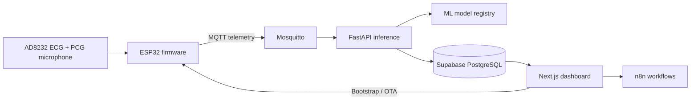

# AscultiCor Application Guide

This document is the single technical reference for AscultiCor. It covers the system architecture, configuration, hardware, device protocols, machine-learning runtime, database, deployment, automation, security, operations, and troubleshooting.

> [!CAUTION]
> AscultiCor is an engineering prototype and is not a certified medical device. Its predictions and generated reports are decision-support outputs only. They must not replace examination by a qualified clinician.

## 1. System Overview

AscultiCor collects electrocardiogram (ECG) and phonocardiogram (PCG) signals from an ESP32 device, transports samples through MQTT, processes signal windows with a FastAPI inference service, and stores operational and analytical data in Supabase. A Next.js dashboard provides patient, device, session, waveform, prediction, report, and administration workflows.



### Components

| Component | Responsibility | Location |
| --- | --- | --- |
| Web application | UI, API routes, authentication, live sessions, provisioning | `frontend/` |
| Inference service | MQTT consumption, preprocessing, model execution, persistence | `inference/` |
| Firmware | Sampling, local checks, MQTT streaming, onboarding, OTA | `firmware/` |
| MQTT broker | Device authentication and message routing | `mosquitto/` |
| Data platform | PostgreSQL schema, RLS, Auth, Storage, Edge Functions | `supabase/` |
| Model artifacts | Versioned production models and encoders | `models/` |
| Device simulator | Synthetic ECG/PCG and telemetry publisher | `simulator/` |
| Automation | Report processing, alerts, OTA, integrity, and operations | `n8n/` |
| Edge proxy | TLS termination and service routing | `nginx/` |

## 2. End-to-End Data Flow

1. An administrator registers or provisions a device from the web application.
2. The device receives its identifier, MQTT connection details, and device-scoped credentials.
3. Firmware samples ECG and PCG channels and publishes session data and telemetry.
4. Mosquitto validates credentials and forwards authorized topics.
5. The inference service validates payloads, buffers windows, preprocesses signals, and runs enabled models.
6. Predictions, signal summaries, session state, and device health are persisted in Supabase.
7. The dashboard polls the application APIs for live and historical state.
8. Optional n8n workflows process queued reports, alerts, integrity checks, and operational events.

The free-tier-compatible application path intentionally uses polling rather than depending on Supabase Realtime publication.

## 3. Configuration

Copy `.env.example` to `.env` for local use or `.env.cloud.example` to `.env.cloud` for a server deployment. The examples document all supported variables.

Important configuration groups include:

- Supabase URL, anonymous key, service-role key, and JWT settings
- public and internal application URLs
- internal API authentication token
- MQTT bind address, public host, ports, TLS mode, and password pepper
- device bootstrap public URL
- model paths and enable/disable flags
- LLM provider and report-queue controls
- n8n credentials and callback URLs

Never commit real environment files. Browser-visible variables beginning with `NEXT_PUBLIC_` must never contain secrets. Use long, independent random values for service-role, internal API, JWT, MQTT, and automation credentials.

## 4. Local Installation

### Requirements

- Docker Engine and Docker Compose v2
- A Supabase project
- Node.js 20+ for frontend development
- Python 3.11 for inference and simulator development
- Arduino IDE or PlatformIO for firmware work

### Database bootstrap

For a new database, run `supabase/migrations/apply_this_in_supabase.sql` in the Supabase SQL editor. For an existing database, apply numbered migrations from `supabase/migrations/` in ascending order. Numbered migrations are the upgrade source of truth.

`supabase/seed.sql` inserts demonstration application records but cannot create `auth.users`. Create users through Supabase Auth, then ensure their application profile and organization membership are correct.

### Start the stack

```bash
cp .env.example .env
docker compose up --build -d
docker compose ps
```

Default endpoints:

| Endpoint | Address |
| --- | --- |
| Dashboard | `http://localhost:3000` |
| Inference API | `http://localhost:8000` |
| MQTT | `mqtt://localhost:1883` |

Inspect service output with `docker compose logs -f <service>` and stop the environment with `docker compose down`.

## 5. Hardware and Firmware

### Typical hardware

- ESP32-WROOM-32 development board
- AD8232 analog ECG module
- PCG microphone/amplifier module
- ECG electrodes and leads
- regulated power source and appropriate passive components

Confirm the exact pin mapping in `firmware/asculticor_esp32/AscultiCor_esp32/AscultiCor_esp32.ino` before wiring. Hardware modules and firmware revisions may use different pins or PCG sensor types. Join all required grounds, verify supply-voltage compatibility, and keep analog signal paths short and separated from noisy power or radio paths.

Do not connect a mains-powered or non-isolated prototype to a person. Battery operation alone does not make an experimental circuit medically safe.

### Firmware lifecycle

1. Install the ESP32 Arduino board package and libraries referenced by the sketch.
2. Select the correct board and serial port.
3. Configure or provision network and bootstrap settings.
4. Build and flash the firmware.
5. Verify serial preflight output, sensor ranges, Wi-Fi, bootstrap, MQTT, and telemetry.
6. Publish production firmware through `firmware/releases/manifest.json` and the corresponding binary assets.

The web provisioning wizard uses Web Serial where supported. The serial protocol is newline-delimited and should return explicit success or error responses. Avoid logging credentials after provisioning.

### OTA safety

- Publish immutable, versioned binaries.
- Keep the release manifest and served firmware synchronized.
- Validate version, size, and checksum before installation.
- Roll out to a test device before broad deployment.
- Preserve a serial recovery path.
- Never interrupt power during flashing.

## 6. MQTT Interface

MQTT is the contract between devices and the backend. Exact topic builders and payload validation live in the firmware, `inference/app/mqtt_handler.py`, and frontend device APIs; update all consumers together.

The topic space covers device status, telemetry, session lifecycle, ECG samples, PCG samples, configuration, and firmware commands. Every payload should carry the registered device identity and use consistent timestamps and sampling metadata.

Operational rules:

- Assign unique credentials per device.
- Restrict publish and subscribe access with Mosquitto ACLs.
- Validate payload size, type, device identity, sample rate, and sequence.
- Use retained messages only for durable state, never raw signal streams.
- Use TLS for MQTT outside a trusted local network.
- Keep the broker private unless physical devices require a reachable endpoint.

## 7. Inference and Models

The inference service subscribes to device topics, builds signal windows, applies preprocessing, executes models through the registry, and persists results. Runtime artifacts are versioned because a clean deployment must include compatible models, encoders, scalers, and configuration.

### Model families

| Signal | Runtime purpose | Artifact area |
| --- | --- | --- |
| PCG | Heart-sound state classification | `models/model1_xgboost/` |
| PCG | Murmur attributes and severity | `models/model2_cnn_severity/` |
| ECG | Single-lead rhythm classification and risk support | `models/model3_bilstm_ecg/` |

Model inputs must match training-time sample rate, window length, preprocessing, feature ordering, tensor shape, and label encoding. Do not replace an artifact without its matching scaler, encoders, configuration, validation evidence, and runtime tests.

Known limitations include sensor noise, motion artifacts, electrode placement, microphone coupling, dataset shift, class imbalance, simulated-versus-physical signal differences, and limited clinical validation. Low confidence or low signal quality should produce an explicit uncertain state rather than a confident diagnosis.

Validate models with:

```bash
cd inference
python -m pytest
python scripts/validate_ecg_model.py
```

Training and experimental code is under `training/` and `new-models/`; production loading paths are controlled by the inference configuration.

## 8. Web Application and API

The Next.js application provides authentication, dashboards, patient records, devices, sessions, alerts, reports, settings, and administrative audit views. Server-side routes protect privileged Supabase operations and internal integrations.

Primary route groups include:

- `/auth` for login and callback handling
- `/dashboard`, `/patients`, `/devices`, and `/sessions` for operational workflows
- `/session/[id]` for live and completed session analysis
- `/reports` and `/alerts` for derived outputs
- `/admin` for controlled administrative functions
- `/api` for device, session, health, n8n, and LLM operations

Do not trust client-provided roles, organization identifiers, or device ownership. Enforce authorization in server routes and database RLS policies. Detailed health diagnostics require the internal token; public health responses must remain minimal.

## 9. Data and Authorization

Supabase supplies Auth, PostgreSQL, Storage, and Edge Functions. The schema models organizations, profiles, patients, devices, sessions, samples/metrics, predictions, reports, alerts, firmware deployments, settings, notes, saved views, and audit events.

Security invariants:

- RLS remains enabled on application tables.
- Users may access only rows belonging to authorized organizations.
- Administrative actions require an explicit server-validated role.
- Service-role keys are server-only.
- Private files use signed upload/download URLs.
- Schema changes are delivered as ordered migrations.
- Audit records must not expose secrets or raw sensitive payloads.

Before applying a migration, test it against a disposable project, review every policy for cross-organization access, and document any required backfill or rollback.

## 10. n8n and Report Automation

n8n is optional and must not sit in the real-time signal path. Workflow definitions under `n8n/workflows/` cover connectivity, queued LLM reports, processing reliability, alert management, OTA operations, data integrity, operational intelligence, and shared failure handling.

Import workflows in numeric order, configure credentials inside n8n, and test with synthetic records. Use bounded retries, idempotency keys, timeouts, rate limits, and a shared failure path. Treat generated clinical language as unverified, label it clearly, and never allow an automation failure to alter raw clinical measurements.

## 11. Deployment

The recommended server layout uses Docker Compose behind Nginx:

```text
Internet -> Nginx (HTTPS) -> Next.js
Physical devices -> MQTT/TLS -> Mosquitto -> Inference
Next.js and Inference -> Supabase
n8n -> authenticated internal application endpoints
```

Deployment sequence:

1. Provision a Linux VM, non-root operator, firewall, DNS, and Docker.
2. Clone the repository and create `.env.cloud` from the example.
3. Install valid TLS certificates and restrict inbound ports.
4. configure Supabase URLs, Auth redirects, RLS, and storage policies.
5. Start `docker compose -f docker-compose.cloud.yml up --build -d`.
6. Verify public health, authenticated flows, MQTT connectivity, inference, persistence, and backups.
7. Provision one test device before enabling production-like traffic.

Never commit certificates, `.env.cloud`, Terraform state, database dumps, or provider credentials. The `hetzner-AscultiCor/terraform/` directory provides infrastructure definitions; its local state and variable values must remain ignored.

## 12. Security Baseline

- Terminate HTTPS with a trusted certificate and use MQTT over TLS remotely.
- Expose only required ports; keep databases and internal services private.
- Rotate default and bootstrap credentials before deployment.
- Use independent secrets with least-privilege service accounts.
- Enforce Supabase RLS and device-specific MQTT ACLs.
- Rate-limit authentication, bootstrap, report, and internal worker endpoints.
- Avoid logging tokens, credentials, raw patient signals, or generated report bodies.
- Patch base images and dependencies regularly.
- Back up the database and configuration, encrypt backups, and test restoration.
- Use synthetic information in development and screenshots.

Report vulnerabilities privately according to the root `SECURITY.md`.

## 13. Testing and Release Checks

```bash
# Frontend
cd frontend
npm ci
npm run lint
npm run typecheck
npm run build

# Inference
cd ../inference
python -m pip install -r requirements.txt
python -m pytest
python -m compileall app

# Simulator
cd ../simulator
python -m pip install -r requirements.txt
python -m pytest
```

On Windows:

```powershell
powershell -NoProfile -ExecutionPolicy Bypass -File ./scripts/security-smoke.ps1
```

Before release, verify migrations, RLS, login, device provisioning, MQTT ACLs, live sessions, inference, report generation, OTA recovery, health endpoints, TLS, logs, backup restoration, and rollback instructions.

## 14. Troubleshooting

### Device cannot connect

- Confirm Wi-Fi credentials, DNS, clock, broker host/port, and TLS mode.
- Ensure `MQTT_BIND_ADDRESS` permits the intended network path.
- Check device registration, derived credentials, ACL entries, and broker logs.
- Verify that the public bootstrap URL is reachable from the device network.

### No live waveform

- Confirm the session is active and the device publishes expected topics.
- Inspect browser network requests, frontend logs, broker traffic, and inference logs.
- Check timestamps, sample rate, sequence, device ID, and database rows.
- Remember that the supported free-tier path uses polling rather than Supabase Realtime.

### Model unavailable or predictions absent

- Inspect the inference health response using authorized detailed diagnostics.
- Verify mounted artifact paths, compatible package versions, encoders, and configuration.
- Confirm window size, sample rate, signal quality, and preprocessing logs.
- Run the model registry and input-contract tests.

### Provisioning or OTA fails

- Use a browser with Web Serial support and close other serial monitors.
- Confirm serial baud rate and newline-delimited command format.
- Check manifest URL, version, binary availability, size, checksum, and TLS trust.
- Recover over serial if an interrupted or invalid update prevents normal boot.

### Supabase access denied

- Confirm the Auth user has a profile and organization membership.
- Review JWT freshness, role, row ownership, and RLS policies.
- Never work around an authorization failure by exposing the service-role key to the browser.

## 15. Maintenance Rules

- Keep this guide synchronized with implementation changes.
- Keep protocol details next to executable validators and tests where possible.
- Add database migrations; never silently edit an already-applied migration.
- Preserve reproducibility metadata with every model artifact.
- Do not commit generated reports, office files, presentations, caches, local state, or credentials.
- Prefer small, reviewable changes with explicit verification evidence.
